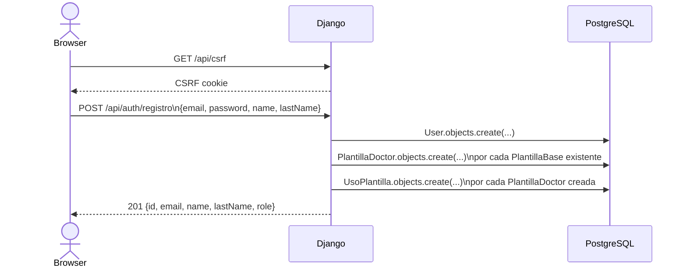
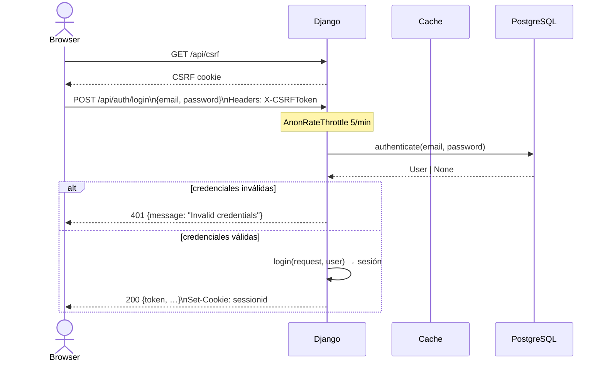
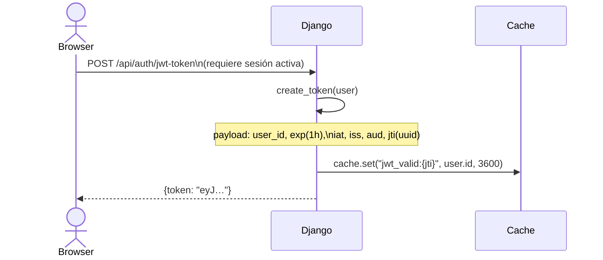
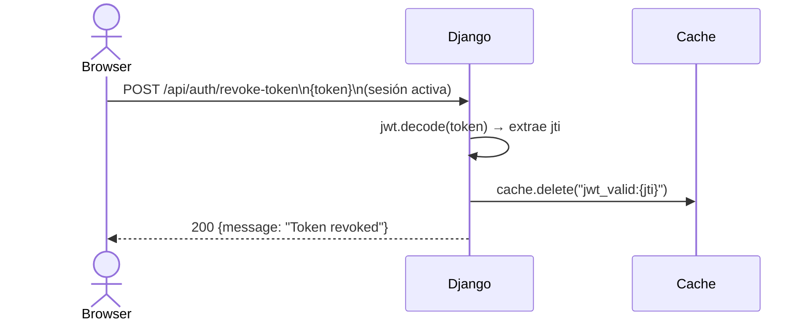
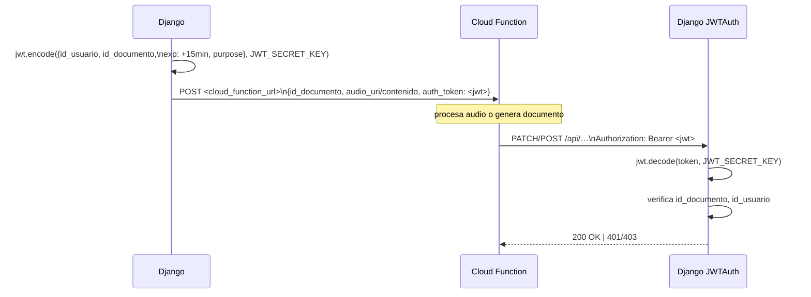
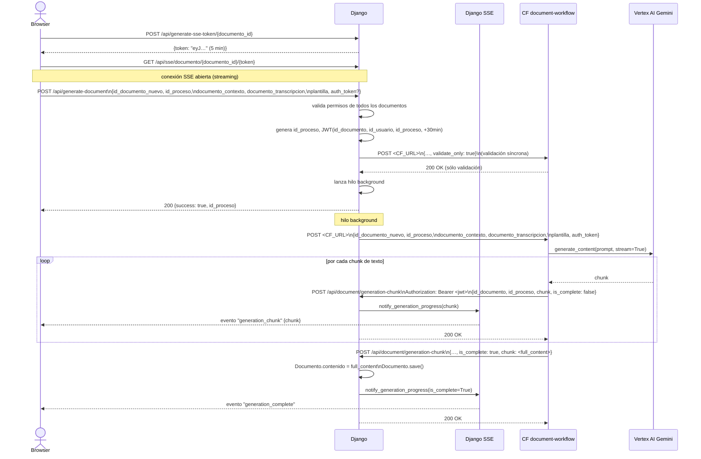
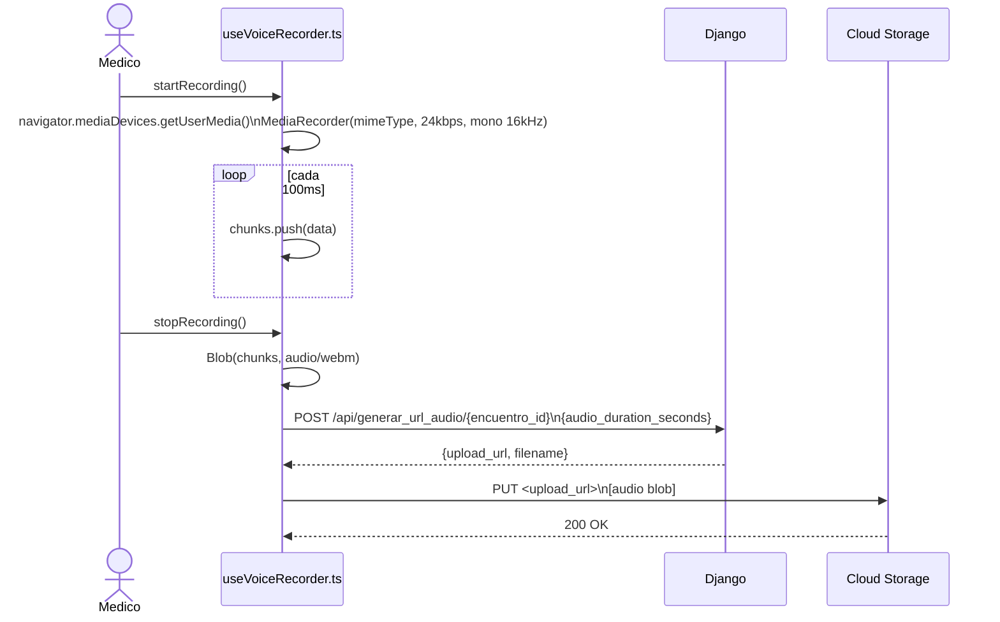
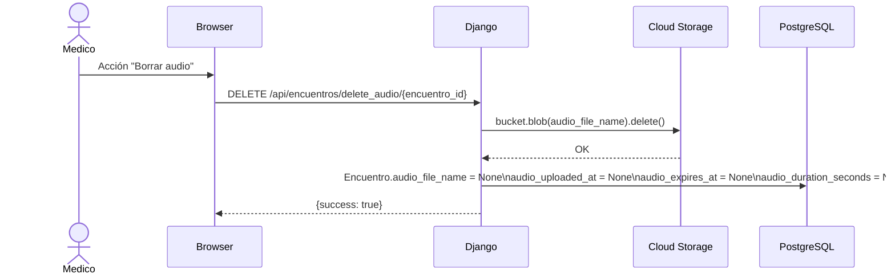

# Flujos del sistema — Diagramas de secuencia

> Documento de Fase 1. Describe los flujos implementados hoy.
> Para el inventario de endpoints y variables de entorno ver [`system_map.md`](system_map.md).
> Para el modelo de datos ver [`database.md`](database.md).

---

## 1. Flujo de autenticación

### 1.1 Registro de nuevo médico



**Archivos:** `apps/users/api.py` → `register_user` (l. 55–99), `apps/plantillas/models.py`.

### 1.2 Login — sesión Django (flujo principal)



**Archivos:** `apps/users/api.py` → `login_user` (l. 102–140), `middlewares.py` → `SessionActivityMiddleware`.

> **Nota:** La sesión expira después de 1 hora de inactividad
> (`SessionActivityMiddleware`, `middlewares.py` l. 27–48).

### 1.3 Login — JWT para uso general (opcional)



**Archivos:** `apps/users/api.py` → `create_token` (l. 33–51), `jwt_token`.

### 1.4 Revocación de token JWT



### 1.5 Tokens internos — Django hacia Cloud Functions

Los endpoints que invocan Cloud Functions generan **JWTs de propósito específico y vida corta**
que la Cloud Function devuelve como Bearer al llamar de vuelta a Django.



**Archivos:** `apps/generative_ai/api.py` l. 157–165, `apps/documentos/api/callbacks.py`,
`utils/auth.py` → `JWTAuth`.

---

## 2. Flujo de transcripción

El flujo completo desde la grabación hasta el texto disponible en el editor.

```mermaid
sequenceDiagram
    actor Browser
    participant Django
    participant GCS as Cloud Storage
    participant CF as CF transcription-endpoint
    participant Gemini as Vertex AI Gemini
    participant SSE as Django SSE

    %% Paso 1 — obtener URL de subida
    Browser->>Django: POST /api/generar_url_audio/{encuentro_id}\n{audio_duration_seconds}
    Django->>GCS: blob.generate_signed_url(PUT, 10min)\nruta: encounter_audio/{id}/{uuid}.mp3
    GCS-->>Django: signed URL
    Django->>Django: Encuentro.audio_file_name = filename\nEncuentro.audio_duration_seconds = N\nEncuentro.audio_uploaded_at = now()\nEncuentro.audio_expires_at = now() + 24h
    Django-->>Browser: {upload_url, filename}

    %% Paso 2 — subir audio directo a GCS
    Browser->>GCS: PUT <signed_url>\nContent-Type: audio/webm;codecs=opus\n[blob de audio]
    GCS-->>Browser: 200 OK

    %% Paso 3 — iniciar transcripción
    Browser->>Django: POST /api/iniciar_transcripcion\n{id_encuentro, id_documento}
    Django->>Django: verifica permisos encuentro y doc
    Django->>Django: comprueba audio_file_name y is_audio_expired()
    Django->>Django: genera JWT(id_usuario, id_documento, +15min, purpose=transcription)
    Django->>CF: POST <TRANSCRIPTION_CLOUD_FUNCTION_URL>\n{id_documento, audio_uri: "gs://…", auth_token}
    Note over Django,CF: llamada SÍNCRONA — Django espera respuesta

    %% Paso 4 — Cloud Function transcribe
    CF->>GCS: Part.from_uri(gs://…, audio/mpeg)
    CF->>Gemini: model.generate_content([audio_part, prompt])
    Gemini-->>CF: texto transcripción

    %% Paso 5 — Cloud Function actualiza documento
    CF->>Django: PATCH /api/documento_by_function/{id_documento}\nAuthorization: Bearer <jwt>\n{contenido: "<transcripción>"}
    Django->>Django: JWTAuth verifica token
    Django->>Django: Documento.contenido = transcripción\nDocumento.save()
    Django->>SSE: notify_document_updated(id_documento, "transcription_complete")
    SSE-->>Browser: evento SSE "transcription_complete"
    Django-->>CF: 200 OK

    %% Paso 6 — notificación final
    CF->>Django: POST /api/notify/transcription-complete\nAuthorization: Bearer <jwt>\n{id_documento}
    Django->>Django: Encuentro.has_been_transcribed = True\nEncuentro.save()
    Django-->>CF: 200 OK

    CF-->>Django: 200 {success: true, …}
    Django->>Django: Encuentro.has_been_transcribed = True\n(también en iniciar_transcripcion)
    Django-->>Browser: 200 {success: true, message}
```

**Archivos clave:**

| Paso | Archivo |
|------|---------|
| Signed URL | `apps/encuentro/api.py` → `generate_upload_url` (l. 185–220) |
| Subida de audio | `webapp/src/features/encuentroHeader/hooks/audio/useVoiceRecorder.ts` → `stopRecording` |
| Inicio transcripción | `apps/generative_ai/api.py` → `iniciar_transcripcion` (l. 105–200) |
| CF: transcripción | `cloud_functions/functions/endpoints/transcription_endpoint.py` |
| CF: Gemini audio | `cloud_functions/functions/services/transcription/audio_processor.py` → `transcribe_audio` |
| CF → Django update | `cloud_functions/functions/services/django_api.py` → `update_document_content` |
| Django callback | `apps/documentos/api/callbacks.py` → `update_documento_content` |
| Notificación final | `apps/documentos/api/callbacks.py` → `transcription_complete_notification` |
| SSE | `apps/documentos/services/sse_hub.py` → `notify_document_updated` (usado desde `sse.py` y callbacks) |

> **Limitación conocida:** la llamada Django → CF en `iniciar_transcripcion` es **síncrona**
> (`requests.post`). Si Gemini tarda mucho, la petición del frontend queda bloqueada
> hasta el timeout de 30 s configurado en `django_api.py`.

---

## 3. Flujo de generación de documentos

Genera un documento clínico combinando contexto, transcripción y plantilla usando Gemini,
con progreso en tiempo real vía SSE.



**Archivos clave:**

| Paso | Archivo |
|------|---------|
| SSE token | `apps/documentos/api/sse.py` → `generate_sse_token` (l. 92–130) |
| Trigger generación | `apps/documentos/api/generation.py` → `generate_document` |
| CF: workflow | `cloud_functions/functions/endpoints/document_workflow.py` |
| CF: Gemini streaming | `cloud_functions/functions/services/document_generation/generator.py` → `generate_content_streaming` |
| CF: send chunks | `cloud_functions/functions/services/django_api.py` → `send_generation_chunk` |
| Django: recibe chunks | `apps/documentos/api/callbacks.py` → `receive_generation_chunk` |
| SSE broadcast | `apps/documentos/api/sse.py` → `notify_generation_progress` |

---

## 4. Flujo de gestión de audio

### 4.1 Grabación y subida (cliente)



### 4.2 Borrado de audio



> **Nota:** el audio **no se borra automáticamente** al completar la transcripción.
> Solo se borra si el usuario lo solicita explícitamente o el médico acciona el botón
> de borrado. El campo `audio_expires_at` (24 h) controla el acceso via API
> (`is_audio_expired()`), pero no elimina el blob de GCS.

---

## 5. Tokens JWT — resumen de propósitos

| Propósito | `purpose` | `exp` | Emisor | Receptor | Campos payload |
|-----------|-----------|-------|--------|----------|----------------|
| Sesión de usuario | — (sesión Django) | 1 h inactividad | Django login | Django (todos los endpoints) | session |
| JWT general usuario | no definido | 1 h | `/api/auth/jwt-token` | cualquier endpoint JWT | `user_id`, `role`, `jti` |
| Transcripción | `transcription` | 15 min | Django `iniciar_transcripcion` | CF → Django (`documento_by_function`, `notify/transcription-complete`) | `id_usuario`, `id_documento` |
| SSE stream | `sse_connection` | 5 min | Django `generate-sse-token` | Django (handshake SSE) | `id_documento`, `id_usuario` |
| Generación | no `purpose` explícito | 30 min | Django `generate-document` | CF → Django (`generation-chunk`) | `id_documento`, `id_usuario`, `id_proceso` |
