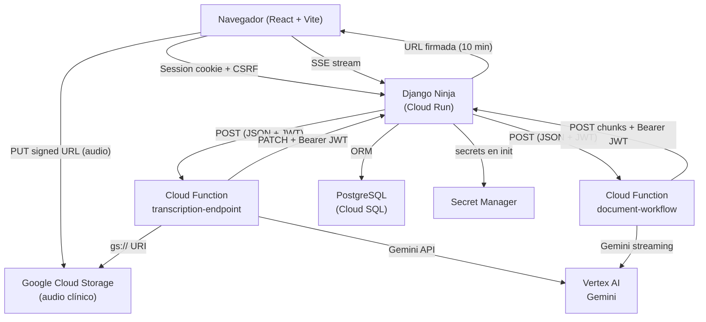

# Mapa del sistema — estado actual

> Documento de Fase 0. Refleja el código tal como está implementado hoy.
> Para normas de calidad y arquitectura objetivo ver [`backend.md`](backend.md).
> Para flujos de transcripción y autenticación ver [`flows.md`](flows.md).
> Para modelo de datos y ERD ver [`database.md`](database.md).

---

## 1. Visión general de servicios



---

## 2. Estructura de carpetas relevante

```
backend/
  config/
    urls.py              ← montaje de NinjaAPI y routers
    settings/
      base.py            ← configuración base
      develop.py         ← dev (dotenv, CORS amplio, Silk)
      production.py      ← prod (variables de entorno, HTTPS estricto)
      test.py            ← test (Secret Manager, fallbacks)
  apps/
    users/               ← autenticación, sesión, JWT propio
    encounters/          ← encuentros + audio GCS
    patients/            ← CRUD pacientes
    templates/           ← plantillas base y DoctorTemplate
    documents/
      api/
        base.py          ← CRUD de documentos (django_auth)
        callbacks.py     ← callbacks de Cloud Functions (JWTAuth)
        generation.py    ← workflow POST /documents/generate (django_auth)
        sse.py           ← Server-Sent Events + tokens SSE
    generative_ai/       ← audio GCS URI, transcripción, tokens de transcripción
  utils/
    auth.py              ← clase JWTAuth (HttpBearer HS256)
  middlewares.py         ← SecurityHeadersMiddleware, SessionActivityMiddleware

cloud_functions/
  functions/
    main.py              ← exports transcription_endpoint, document_workflow
    endpoints/
      transcription_endpoint.py
      document_workflow.py
    services/
      transcription/
        audio_processor.py   ← Vertex AI / Gemini sobre gs:// URI
        extractor.py
      document_generation/
        generator.py         ← Gemini streaming + send_generation_chunk
        formatter.py
      django_api.py          ← PATCH document content, generation-chunk, notify
    models/
      gemini_client.py       ← vertexai.init + GenerativeModel
    utils/
      secret_manager.py      ← carga secrets en entorno de producción

webapp/
  src/
    commons/utils/
      axiosInstance.ts       ← base URL = VITE_API_URL, credenciales incluidas
    contexts/                ← estado global (DocumentContext, TranscriptionContext, …)
    features/
      encuentroHeader/       ← UI en español; rutas API en inglés
        hooks/audio/
          useVoiceRecorder.ts
          uploadService.ts
      encuentroTextArea/
        hooks/
          useDocumentGeneration.tsx
          useDocuments.ts
```

---

## 3. Inventario de endpoints

El prefijo global de la API es `/api/`. El `NinjaAPI` se monta en `config/urls.py` en `/api/`.
CSRF está deshabilitado en `dev`; habilitado en otros entornos (`csrf=not dev`).

Los **paths y nombres de recursos** en las tablas siguientes están en **inglés** (contrato wire). Los textos de error al usuario pueden seguir en español.

### 3.1 Autenticación y usuarios — `/api/auth/` (`apps/users/api.py`)

| Método | Path | Auth | Notas |
|--------|------|------|-------|
| GET | `/api/csrf` | público | Establece CSRF cookie. Definido en `urls.py`. |
| GET | `/api/auth/csrf-token` | público | Alternativa al endpoint raíz. |
| POST | `/api/auth/register` | público | Registro; payload incluye `last_name`. |
| POST | `/api/auth/login` | público | `AnonRateThrottle(5/m)`. Sesión Django. |
| POST | `/api/auth/logout` | público | Destruye sesión Django. |
| POST | `/api/auth/jwt-token` | `django_auth` | JWT HS256 (1 h, `jti` en caché). |
| POST | `/api/auth/revoke-token` | `django_auth` | Elimina `jti` del caché. |
| GET | `/api/auth/me` | `django_auth` | Perfil del usuario en sesión. |
| GET | `/api/auth/me/data` | `django_auth` | Datos extendidos (`last_name`, etc.). |
| GET | `/api/auth/users` | `django_auth` | Lista usuarios (admin). |
| GET | `/api/auth/users/{user_id}` | `django_auth` | Perfil de un usuario. |
| PUT | `/api/auth/users/{user_id}` | `django_auth` | Actualiza perfil. |
| DELETE | `/api/auth/users/{user_id}` | `django_auth` | Elimina usuario. |

### 3.2 Documentos — base CRUD (`apps/documents/api/base.py`)

| Método | Path | Auth | Notas |
|--------|------|------|-------|
| POST | `/api/documents` | `django_auth` | Body: `encounter_id`, `kind`, `content`, opcional `doctor_template_id`. |
| GET | `/api/documents/encounter/{encounter_id}` | `django_auth` | Lista documentos del encuentro. |
| GET | `/api/documents/{document_id}` | `django_auth` | Detalle / contenido (`content`, `kind`, …). |
| PATCH | `/api/documents/by-editor/{document_id}` | `django_auth` | Body: `{ "content": "..." }`. |
| DELETE | `/api/documents/{document_id}` | `django_auth` | Elimina documento. |
| GET | `/api/debug-auth` | **público** | Solo depuración; retirar en producción. |

### 3.3 Documentos — callbacks CF y generación (`apps/documents/api/callbacks.py`, `generation.py`)

| Método | Path | Auth | Notas |
|--------|------|------|-------|
| POST | `/api/documents/generate` | `django_auth` | Inicia generación; body: `context_document_id`, `transcription_document_id`, `doctor_template_id`, `new_document_id`. |
| PATCH | `/api/documents/by-function/{document_id}` | `JWTAuth` | CF transcripción: actualiza `content`. |
| POST | `/api/documents/generation-chunk` | `JWTAuth` | CF generación: chunks; claims `document_id`, `process_id`. |
| POST | `/api/transcription/notify-complete` | `JWTAuth` | CF notifica fin; emite SSE `transcription_complete`. |

### 3.4 Documentos — SSE (`apps/documents/api/sse.py`)

| Método | Path | Auth | Notas |
|--------|------|------|-------|
| POST | `/api/generate-sse-token/{document_id}` | `django_auth` | Token corta vida para SSE. |
| GET | `/api/sse/document/{document_id}/{token}` | token en URL | Stream SSE; eventos con `document_id` en JSON. |
| GET | `/api/sse/document/{document_id}` | `django_auth` | Alternativa con sesión Django. |

### 3.5 Encuentros y audio (`apps/encounters/api.py`)

| Método | Path | Auth | Notas |
|--------|------|------|-------|
| GET | `/api/encounters` | `django_auth` | Lista encuentros del médico. |
| GET | `/api/encounters/{encounter_id}` | `django_auth` | Detalle (`encounter_name`, `occurred_at`, `patient_id`, …). |
| POST | `/api/encounters` | `django_auth` | Crea encuentro + documentos iniciales (`context`, `transcription`). |
| PATCH | `/api/encounters/{encounter_id}` | `django_auth` | Actualiza `encounter_name`, `patient_id`, `occurred_at`, etc. |
| DELETE | `/api/encounters/{encounter_id}` | `django_auth` | Elimina encuentro. |
| POST | `/api/encounters/{encounter_id}/audio/upload-url` | `django_auth` | URL firmada PUT GCS; body `audio_duration_seconds`. |
| GET | `/api/encounters/{encounter_id}/audio/exists` | `django_auth` | `exists`, `duration`, `has_been_transcribed`. |
| DELETE | `/api/encounters/{encounter_id}/audio` | `django_auth` | Borra audio en GCS y limpia BD. |

### 3.6 Inteligencia artificial — `apps/generative_ai/api.py`

| Método | Path | Auth | Notas |
|--------|------|------|-------|
| GET | `/api/encounters/{encounter_id}/audio/gcs-uri` | `django_auth` | `gs://` URI para Gemini. |
| POST | `/api/documents/{document_id}/transcription-token` | `django_auth` | JWT callback transcripción (15 min). |
| POST | `/api/transcription/start` | `django_auth` | Body: `document_id`, `encounter_id`; invoca CF. |

### 3.7 Pacientes (`apps/patients/api.py`)

| Método | Path | Auth | Notas |
|--------|------|------|-------|
| POST | `/api/patients` | `django_auth` | Body: `name`, `summary`. |
| PUT | `/api/patients/{patient_id}` | `django_auth` | Actualiza `name`, `summary`. |
| GET | `/api/patients/search` | `django_auth` | Query `name`. |

### 3.8 Plantillas (`apps/templates/api.py`)

| Método | Path | Auth | Notas |
|--------|------|------|-------|
| POST | `/api/doctor-templates` | `django_auth` | Crea `DoctorTemplate`. |
| GET | `/api/doctor-templates/short` | `django_auth` | Lista resumida (`use_count`, `is_base`, …). |
| GET | `/api/doctor-templates/{template_id}` | `django_auth` | Detalle + contenido efectivo. |
| PATCH | `/api/doctor-templates/{template_id}` | `django_auth` | Actualiza `name`, `document_kind`, `content`. |
| POST | `/api/doctor-templates/{template_id}/usage` | `django_auth` | Incrementa uso (`TemplateUsage`). |
| DELETE | `/api/doctor-templates/{template_id}` | `django_auth` | No borra plantillas con `uses_base_content`. |

### 3.9 Cloud Functions (invocadas por Django, no expuestas al frontend)

| Función | URL | Caller | Notas |
|---------|-----|--------|-------|
| Transcripción | `$TRANSCRIPTION_CLOUD_FUNCTION_URL` | Django `POST /api/transcription/start` | JWT en body (`auth_token`). |
| Generación documentos | `$GENERATE_DOCUMENT_CLOUD_FUNCTION_URL` | Django `POST /api/documents/generate` | Payload JSON en inglés (`new_document_id`, `process_id`, …). |

---

## 4. Mecanismos de autenticación

| Mecanismo | Dónde se usa | Implementación |
|-----------|-------------|----------------|
| Sesión Django (`django_auth`) | Frontend → Django (todos los endpoints de negocio) | `SessionMiddleware` + `authenticate()`/`login()`. Cookie `sessionid`. |
| JWT HS256 (`JWTAuth`) | Cloud Functions → Django (callbacks) | `utils/auth.py` `JWTAuth(HttpBearer)`. Secreto: `JWT_SECRET_KEY`. |
| Token SSE | Frontend → Django (stream SSE) | JWT corta vida en URL path. Generado en `POST /api/generate-sse-token/{document_id}`. |
| JWT usuario (`/api/auth/jwt-token`) | Uso general opcional | Payload: `user_id`, `exp`, `iat`, `iss`, `aud`, `jti`. `jti` en caché Django. |

> **Nota:** Los endpoints de Cloud Functions están desplegados con `--allow-unauthenticated`.
> La única protección contra llamadas externas no autorizadas es que el JWT del body
> sea válido, lo que depende del `JWT_SECRET_KEY` no siendo conocido por terceros.

---

## 5. Estado en memoria compartido (riesgo en multi-instancia)

`apps/documents/services/sse_hub.py` mantiene en memoria del proceso:

```python
event_queues = {}         # colas de eventos por document_id (str)
connections_lock = threading.Lock()
```

Con múltiples réplicas en Cloud Run, un evento generado en la instancia A
no llega a clientes SSE conectados a la instancia B.
Ver deuda técnica en el reporte de seguridad y arquitectura.

---

## 6. Módulo de settings (explícito)

| `DJANGO_SETTINGS_MODULE` | Uso típico |
|--------------------------|------------|
| `config.settings.develop` | Local, `manage.py` por defecto, servicio Compose `web` |
| `config.settings.test` | `pytest.ini`, imagen `Dockerfile.test` / perfil `test` |
| `config.settings.production` | Imagen `Dockerfile` (Gunicorn), `wsgi`/`asgi` por defecto |

`config.settings` (paquete) reexporta **develop** solo por compatibilidad. Política de secretos: [`secrets_and_environments.md`](secrets_and_environments.md). Docker: [`docker.md`](docker.md).

---

## 7. Variables de entorno relevantes

| Variable | Dónde se usa | Entorno |
|----------|-------------|---------|
| `DJANGO_SECRET_KEY` | Django (`SECRET_KEY`) | todos |
| `JWT_SECRET_KEY` | firma/verificación JWT HS256 | todos |
| `GCS_BUCKET_NAME` | subida/borrado de audio | todos |
| `GCP_STORAGE_SERVICE_ACCOUNT_KEY_PATH` | GCS en dev (archivo JSON) | dev |
| `SERVICE_ACCOUNT_JSON` | GCS en no-dev (JSON en variable) | prod/test |
| `TRANSCRIPTION_CLOUD_FUNCTION_URL` | Django llama a CF transcripción | todos |
| `GENERATE_DOCUMENT_CLOUD_FUNCTION_URL` | Django llama a CF generación (alias opcional `GENERATE_DOCUMENT_CLOUD_FUNCTION_BASE_URL` en develop) | todos |
| `DJANGO_API_BASE_URL` | CF llama de vuelta a Django | CF runtime |
| `GCP_PROJECT` | Vertex AI init | CF runtime |
| `GCP_REGION` | Vertex AI init | CF runtime |
| `GEMINI_MODEL` | modelo Gemini a usar | CF runtime |
| `VITE_API_URL` | base URL del frontend | build |
| `DB_NAME`, `DB_USER`, `DB_PASSWORD`, `DB_HOST`, `DB_PORT` | PostgreSQL | todos |
