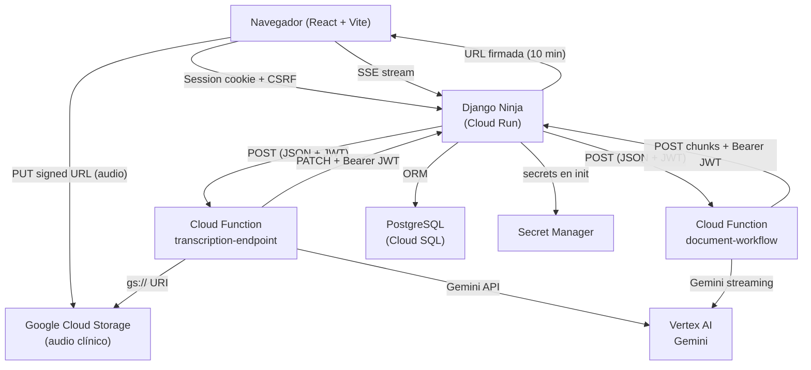

# System Map — Estado actual del sistema

> Documento de Fase 0. Refleja el código tal como está implementado hoy.
> Para normas de calidad y arquitectura objetivo ver [`backend.md`](backend.md).
> Para flujos de transcripción y autenticación ver [`flows.md`](flows.md).
> Para modelo de datos y ERD ver [`database.md`](database.md).

---

## 1. Visión general de servicios



---

## 2. Estructura de carpetas relevante

```
backend/
  config/
    urls.py              ← montaje de NinjaAPI y routers
    settings/
      base.py            ← configuración base
      develop.py         ← dev (dotenv, CORS amplio, Silk)
      production.py      ← prod (variables de entorno, HTTPS estricto)
      test.py            ← test (Secret Manager, fallbacks)
  apps/
    users/               ← autenticación, sesión, JWT propio
    encuentro/           ← encounters + audio GCS
    pacientes/           ← CRUD pacientes
    plantillas/          ← plantillas por médico
    documentos/
      api/
        base.py          ← CRUD de documentos (django_auth)
        callbacks.py     ← callbacks de Cloud Functions (JWTAuth)
        generation.py    ← workflow generate-document (django_auth)
        sse.py           ← Server-Sent Events + tokens SSE
    generative_ai/       ← endpoints que invocan las Cloud Functions
  utils/
    auth.py              ← clase JWTAuth (HttpBearer HS256)
  middlewares.py         ← SecurityHeadersMiddleware, SessionActivityMiddleware

cloud_functions/
  functions/
    main.py              ← exports transcription_endpoint, generate_document_workflow
    endpoints/
      transcription_endpoint.py
      document_workflow.py
    services/
      transcription/
        audio_processor.py   ← Vertex AI / Gemini sobre gs:// URI
        extractor.py
      document_generation/
        generator.py         ← Gemini streaming + send_generation_chunk
        formatter.py
      django_api.py          ← update_document_content, send_generation_chunk, notify_*
    models/
      gemini_client.py       ← vertexai.init + GenerativeModel
    utils/
      secret_manager.py      ← carga secrets en entorno de producción

webapp/
  src/
    commons/utils/
      axiosInstance.ts       ← base URL = VITE_API_URL, credenciales incluidas
    contexts/                ← estado global (DocumentContext, TranscriptionContext, …)
    features/
      encuentroHeader/
        hooks/audio/
          useVoiceRecorder.ts    ← MediaRecorder + upload a GCS
          uploadService.ts       ← generateAudioUploadUrl, uploadAudioToCloud
      encuentroTextArea/
        hooks/
          useDocumentGeneration.tsx
          useDocuments.ts
```

---

## 3. Inventario de endpoints

El prefijo global de la API es `/api/`. El `NinjaAPI` se monta en `config/urls.py` en `/api/`.
CSRF está deshabilitado en `dev`; habilitado en otros entornos (`csrf=not dev`).

### 3.1 Autenticación y usuarios — `/api/auth/` (`apps/users/api.py`)

| Método | Path | Auth | Notas |
|--------|------|------|-------|
| GET | `/api/csrf` | público | Establece CSRF cookie. Definido en `urls.py`. |
| GET | `/api/auth/csrf-token` | público | Alternativa al endpoint raíz. |
| POST | `/api/auth/registro` | público | Crea usuario + PlantillaDoctor desde PlantillaBase. Sin rate limit. |
| POST | `/api/auth/login` | público | `AnonRateThrottle(5/m)`. `authenticate()` + `login()` → session cookie. |
| POST | `/api/auth/logout` | público | Destruye sesión Django. |
| POST | `/api/auth/jwt-token` | `django_auth` | Genera JWT HS256 (1 h, `jti` en caché). |
| POST | `/api/auth/revoke-token` | `django_auth` | Elimina `jti` del caché. |
| GET | `/api/auth/me` | `django_auth` | Perfil del usuario en sesión. |
| GET | `/api/auth/me/data` | `django_auth` | Datos extendidos del médico. |
| GET | `/api/auth/users` | `django_auth` | Lista usuarios (admin). |
| GET | `/api/auth/users/{user_id}` | `django_auth` | Perfil de un usuario. |
| PUT | `/api/auth/users/{user_id}` | `django_auth` | Actualiza perfil. |
| DELETE | `/api/auth/users/{user_id}` | `django_auth` | Elimina usuario. |

### 3.2 Documentos — base CRUD (`apps/documentos/api/base.py`)

| Método | Path | Auth | Notas |
|--------|------|------|-------|
| POST | `/api/documento` | `django_auth` | Crea documento; valida pertenencia del encuentro. |
| GET | `/api/documento/encuentro/{encuentro_id}` | `django_auth` | Lista docs de un encuentro. |
| GET | `/api/documento/{documento_id}` | `django_auth` | Obtiene contenido de un doc. |
| PATCH | `/api/documento_by_editor/{documento_id}` | `django_auth` | Usuario edita texto manualmente. |
| DELETE | `/api/documento/{documento_id}` | `django_auth` | Elimina un doc. |
| GET | `/api/debug-auth` | **público** | Devuelve headers del request. Pendiente de remover. |

### 3.3 Documentos — callbacks CF (`apps/documentos/api/callbacks.py`) y generación (`apps/documentos/api/generation.py`)

| Método | Path | Auth | Notas |
|--------|------|------|-------|
| POST | `/api/generate-document` | `django_auth` | Frontend inicia generación; Django valida y lanza hilo. |
| PATCH | `/api/documento_by_function/{documento_id}` | `JWTAuth` | Callback de CF transcripción: escribe transcripción. |
| POST | `/api/document/generation-chunk` | `JWTAuth` | Callback de CF generación: recibe chunk y emite SSE. |
| POST | `/api/notify/transcription-complete` | `JWTAuth` | CF notifica fin de transcripción; Django emite SSE. |

### 3.4 Documentos — SSE (`apps/documentos/api/sse.py`)

| Método | Path | Auth | Notas |
|--------|------|------|-------|
| POST | `/api/generate-sse-token/{documento_id}` | `django_auth` | Genera token de corta vida (5 min) para SSE. |
| GET | `/api/sse/documento/{documento_id}/{token}` | token en URL | Stream SSE; token validado en handshake. |
| GET | `/api/sse/documento/{documento_id}` | `django_auth` | Alternativa con sesión Django. |

### 3.5 Encuentros y audio (`apps/encuentro/api.py`)

| Método | Path | Auth | Notas |
|--------|------|------|-------|
| GET | `/api/encuentros` | `django_auth` | Lista encuentros del médico autenticado. |
| GET | `/api/encuentros/{encuentro_id}` | `django_auth` | Detalle de un encuentro. |
| POST | `/api/encuentros` | `django_auth` | Crea encuentro + docs vacíos (contexto + transcripción). |
| PATCH | `/api/encuentros/{encuentro_id}` | `django_auth` | Actualiza encuentro (nombre, paciente, fecha). |
| DELETE | `/api/encuentros/{encuentro_id}` | `django_auth` | Elimina encuentro. |
| POST | `/api/generar_url_audio/{encuentro_id}` | `django_auth` | GCS signed URL (PUT, 10 min). Guarda `audio_file_name`. |
| GET | `/api/encuentros/audio_exists/{encuentro_id}` | `django_auth` | Comprueba si hay audio en GCS. |
| DELETE | `/api/encuentros/delete_audio/{encuentro_id}` | `django_auth` | Borra blob de GCS y limpia campos en BD. |

### 3.6 Inteligencia artificial — generative_ai (`apps/generative_ai/api.py`)

| Método | Path | Auth | Notas |
|--------|------|------|-------|
| GET | `/api/obtener_url_audio/{encuentro_id}` | `django_auth` | Devuelve `gs://` URI para uso interno/Gemini. |
| POST | `/api/autorizar-documento/{documento_id}` | `django_auth` | Genera JWT propósito `transcription` (15 min). |
| POST | `/api/iniciar_transcripcion` | `django_auth` | Valida permisos, construye JWT, llama CF transcripción de forma **síncrona**. |

### 3.7 Pacientes (`apps/pacientes/api.py`)

| Método | Path | Auth | Notas |
|--------|------|------|-------|
| POST | `/api/paciente` | `django_auth` | Crea paciente + relación PacienteMedico. Solo rol `medico`. |
| PUT | `/api/paciente/{paciente_id}` | `django_auth` | Edita datos del paciente. Verifica relación médico-paciente. |
| GET | `/api/pacientes/search` | `django_auth` | Búsqueda por nombre (icontains). Solo pacientes del médico. |

### 3.8 Plantillas (`apps/plantillas/api.py`)

| Método | Path | Auth | Notas |
|--------|------|------|-------|
| POST | `/api/plantilla_doctor` | `django_auth` | Crea plantilla propia (contenido_base=False). |
| GET | `/api/plantillas_short` | `django_auth` | Lista con ID, nombre, tipo y estadísticas de uso. |
| GET | `/api/plantilla_doctor/{id_plantilla}` | `django_auth` | Detalle con contenido efectivo (propio o de base). |
| PATCH | `/api/plantilla_doctor/{id_plantilla}` | `django_auth` | Actualiza nombre, tipo y contenido. |
| POST | `/api/plantilla_doctor/uso/{id_plantilla}` | `django_auth` | Registra uso: incrementa `veces_usada`, actualiza `ultimo_uso`. |
| DELETE | `/api/plantillas/{id_plantilla}` | `django_auth` | Elimina plantilla y sus `UsoPlantilla`. No permite borrar `contenido_base=True`. |

### 3.9 Cloud Functions (invocadas por Django, no expuestas al frontend)

| Función | URL | Caller | Notas |
|---------|-----|--------|-------|
| `transcription-endpoint` | `$TRANSCRIPTION_CLOUD_FUNCTION_URL` | Django (`iniciar_transcripcion`) | `--allow-unauthenticated`. JWT en body. |
| `document-workflow` | `$GENERATE_DOCUMENT_CLOUD_FUNCTION_URL` | Django (`generate-document`) | `--allow-unauthenticated`. JWT en body. |

---

## 4. Mecanismos de autenticación

| Mecanismo | Dónde se usa | Implementación |
|-----------|-------------|----------------|
| Sesión Django (`django_auth`) | Frontend → Django (todos los endpoints de negocio) | `SessionMiddleware` + `authenticate()`/`login()`. Cookie `sessionid`. |
| JWT HS256 (`JWTAuth`) | Cloud Functions → Django (callbacks) | `utils/auth.py` `JWTAuth(HttpBearer)`. Secreto: `JWT_SECRET_KEY`. |
| Token SSE | Frontend → Django (stream SSE) | JWT corta vida (5 min) en URL path. Generado en `/api/generate-sse-token/`. |
| JWT usuario (`/api/auth/jwt-token`) | Uso general opcional | Payload: `user_id`, `exp`, `iat`, `iss`, `aud`, `jti`. `jti` en caché Django. |

> **Nota:** Los endpoints de Cloud Functions están desplegados con `--allow-unauthenticated`.
> La única protección contra llamadas externas no autorizadas es que el JWT del body
> sea válido, lo que depende del `JWT_SECRET_KEY` no siendo conocido por terceros.

---

## 5. Estado en memoria compartido (riesgo en multi-instancia)

`apps/documentos/api/sse.py` mantiene en memoria del proceso:

```python
sse_clients = {}          # clientes SSE activos por documento
event_queues = {}         # colas de eventos por documento
connections_lock = threading.Lock()
```

Con múltiples réplicas en Cloud Run, un evento generado en la instancia A
no llega a clientes SSE conectados a la instancia B.
Ver deuda técnica en el reporte de seguridad y arquitectura.

---

## 6. Variables de entorno relevantes

| Variable | Dónde se usa | Entorno |
|----------|-------------|---------|
| `DJANGO_SECRET_KEY` | Django (`SECRET_KEY`) | todos |
| `JWT_SECRET_KEY` | firma/verificación JWT HS256 | todos |
| `GCS_BUCKET_NAME` | subida/borrado de audio | todos |
| `GCP_STORAGE_SERVICE_ACCOUNT_KEY_PATH` | GCS en dev (archivo JSON) | dev |
| `SERVICE_ACCOUNT_JSON` | GCS en no-dev (JSON en variable) | prod/test |
| `TRANSCRIPTION_CLOUD_FUNCTION_URL` | Django llama a CF transcripción | todos |
| `GENERATE_DOCUMENT_CLOUD_FUNCTION_BASE_URL` | Django llama a CF generación | todos |
| `DJANGO_API_BASE_URL` | CF llama de vuelta a Django | CF runtime |
| `GCP_PROJECT` | Vertex AI init | CF runtime |
| `GCP_REGION` | Vertex AI init | CF runtime |
| `GEMINI_MODEL` | modelo Gemini a usar | CF runtime |
| `VITE_API_URL` | base URL del frontend | build |
| `DB_NAME`, `DB_USER`, `DB_PASSWORD`, `DB_HOST`, `DB_PORT` | PostgreSQL | todos |
