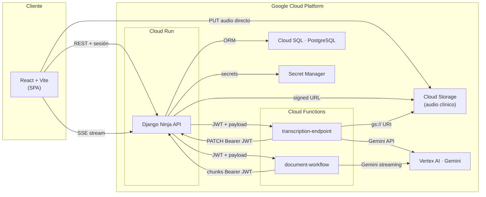
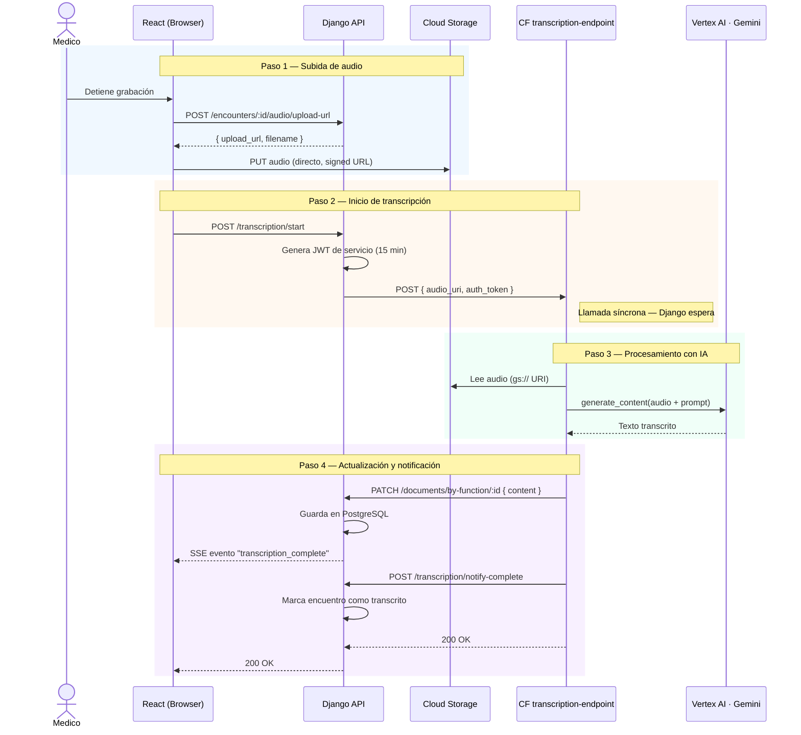

# Visión General del Sistema

Este documento describe la arquitectura global de la plataforma, sus componentes principales y cómo interactúan entre sí.

## 1. Arquitectura de Alto Nivel

El sistema es una plataforma fullstack que combina un backend Django, funciones serverless en GCP y una SPA en React. La pieza central es el backend Django, que coordina la comunicación entre todos los demás servicios.

---

## 2. Flujo de Transcripción de Audio

El camino completo desde que el médico detiene la grabación hasta que el texto aparece en el editor.

---

## 3. Flujo de Generación de Documentos

Genera un documento clínico (SOAP, nota de evolución, etc.) combinando la transcripción, el contexto del paciente y una plantilla, con streaming en tiempo real vía SSE.

---

## 4. Componentes y Responsabilidades

| Componente | Stack | Responsabilidad |
|------------|-------|-----------------|
| **Frontend** `webapp/` | React 18, Vite, TypeScript, Tailwind | SPA del médico. Maneja grabación, UI del editor y conexión SSE. |
| **Backend** `backend/` | Django Ninja, PostgreSQL | API REST central. Orquesta flujos, emite JWTs, mantiene hub SSE. |
| **CF Transcripción** | Python, Functions Framework | Recibe audio de GCS → llama a Gemini → devuelve texto a Django. |
| **CF Generación** | Python, Functions Framework | Recibe contexto+plantilla → streaming desde Gemini → envía chunks a Django. |
| **Cloud Storage** | GCS | Almacena los audios clínicos. El frontend sube directo vía signed URL. |
| **Vertex AI · Gemini** | Managed (GCP) | Modelo de IA para transcripción y generación de documentos clínicos. |
| **PostgreSQL** | Cloud SQL | Base de datos principal: encuentros, documentos, pacientes, plantillas. |

---

## 5. Puntos de Atención Arquitectónica

- **Hub SSE en memoria**: `apps/documents/services/sse_hub.py` usa estructuras en memoria. Con múltiples réplicas en Cloud Run, un evento emitido en la instancia A no llega a clientes SSE en la instancia B. Resolver con Redis o Pub/Sub en el futuro.
- **Llamada síncrona a CF de transcripción**: Django espera respuesta de la Cloud Function. Si Gemini tarda demasiado, el request del frontend puede agotar el timeout.
- **Audio no se borra al transcribir**: `audio_expires_at` controla el acceso vía API, pero el blob en GCS solo se elimina si el médico lo solicita explícitamente.
- **Cloud Functions `--allow-unauthenticated`**: La seguridad se delega enteramente en la validez del JWT del body. El `JWT_SECRET_KEY` no debe filtrarse.

---

## 6. Observabilidad y trazas

OpenTelemetry enlaza las peticiones **navegador (XHR/axios) → Django → Cloud Functions → callbacks Django** cuando el export está configurado (OTLP/Jaeger en local, Cloud Trace en GCP con `GOOGLE_CLOUD_PROJECT`). Los logs del backend incluyen `trace_id` / `span_id` para correlación. Detalle y variables: [`../backend/tracing.md`](../backend/tracing.md). Limitaciones: SSE (`EventSource` sin cabeceras W3C) y subida directa a GCS con signed URL no continúan el mismo trace de extremo a extremo.
