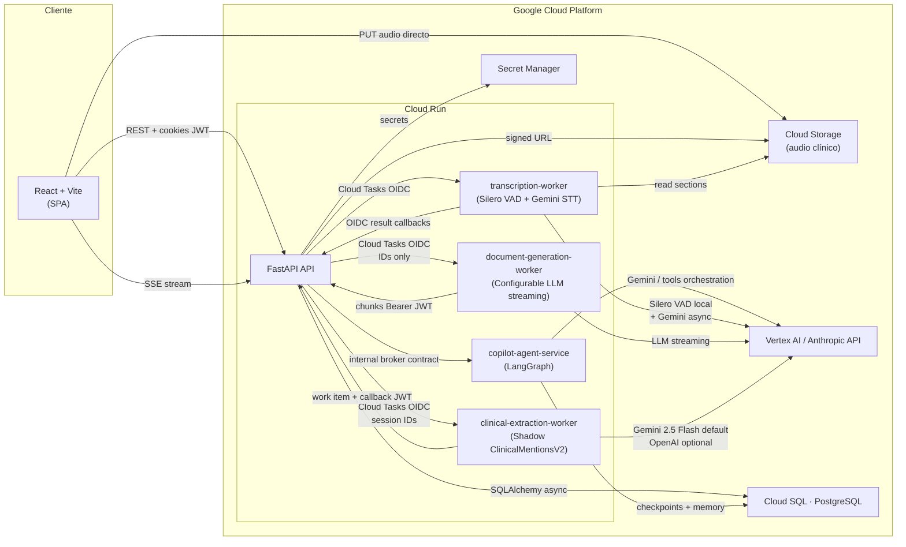
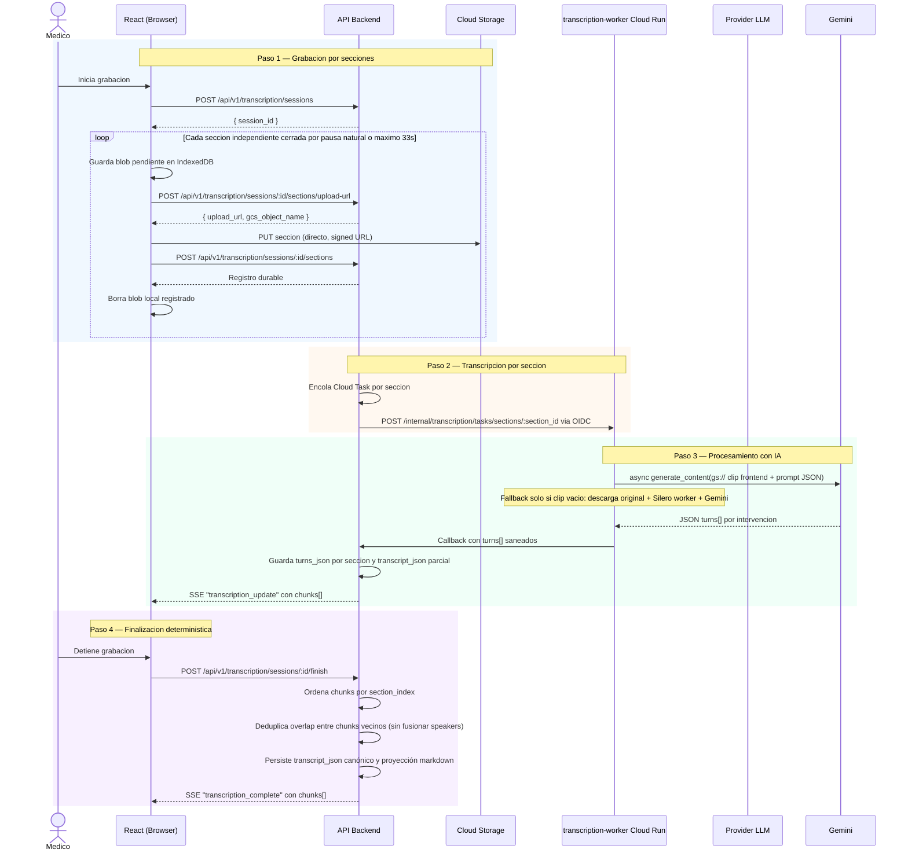
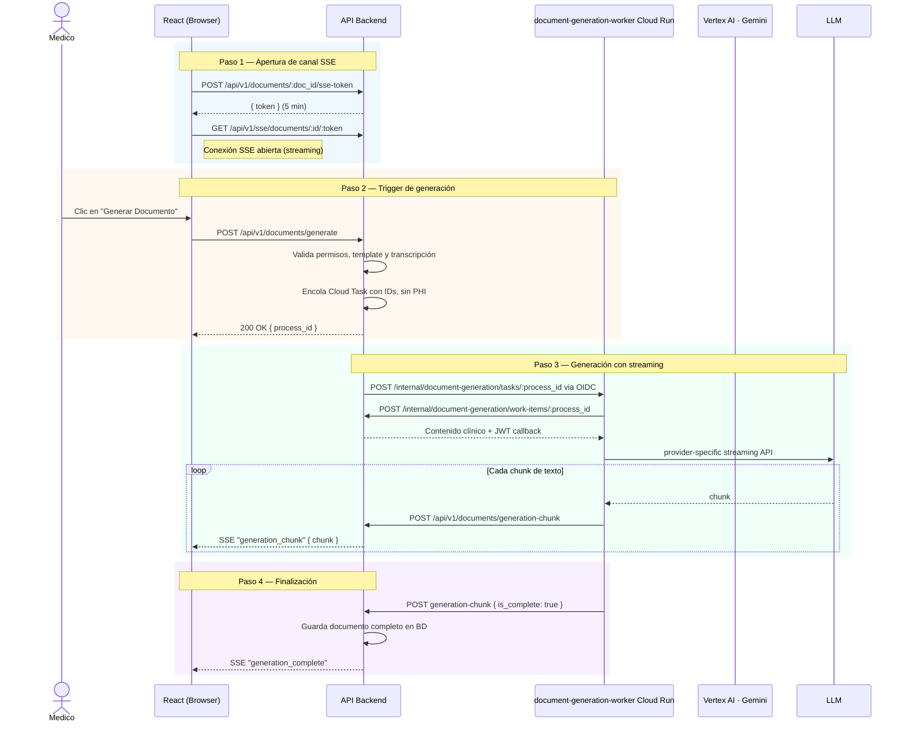

# Visión General del Sistema

Este documento describe la arquitectura global de la plataforma, sus componentes principales y cómo interactúan entre sí.

## 1. Arquitectura de Alto Nivel

El sistema es una plataforma fullstack con un **API FastAPI** en `backend_fastapi/`,
workers Cloud Run privados, un runtime del copiloto y una SPA en React.

---

## 2. Flujo de Transcripción de Audio

El camino implementado usa transcripción near realtime por secciones. Mientras
el médico graba, el navegador corta audio en secciones temporales, conserva una
cola local en IndexedDB y sube cada blob directo a Cloud Storage mediante signed
URLs. FastAPI registra cada seccion de forma idempotente, Cloud Tasks dispara el
servicio `transcription-worker` y SSE publica avances parciales. El flujo legacy de audio completo
queda como fallback/migración.

---

## 3. Flujo de Generación de Documentos

Genera un documento clínico (SOAP, nota de evolución, etc.) combinando la transcripción, el contexto del paciente y una plantilla, con streaming en tiempo real vía SSE. En el slice migrado, el kickoff, SSE token y callbacks de generación viven en FastAPI bajo `/api/v1`.

## 4. Extracción Clínica Shadow

Cuando una sesión segmentada llega a `consolidated`, FastAPI puede disparar
`clinical-extraction-worker` si `CLINICAL_EXTRACTION_ENABLED=true`. El worker
pide un work item interno con `transcript_json.chunks[].turns[]`, extrae
`ClinicalMentionsV2`, y devuelve el resultado con un callback JWT de propósito
`clinical_extraction`.

Esta etapa es independiente y silenciosa: no cambia `content_markdown`, no
participa en generación documental, no publica SSE y no bloquea la nota si falla.
FastAPI persiste la salida cruda, el JSON post-grounding, evidencia por cita y
métricas de observabilidad para revisión shadow.

---

## 5. Componentes y Responsabilidades

| Componente                           | Stack                                   | Responsabilidad                                                                                                            |
| ------------------------------------ | --------------------------------------- | -------------------------------------------------------------------------------------------------------------------------- |
| **Frontend** `webapp/`               | React 18, Vite, TypeScript, Tailwind    | SPA del médico. Maneja grabación por secciones, IndexedDB, UI del editor y conexión SSE.                                   |
| **API principal** `backend_fastapi/` | FastAPI, SQLAlchemy async, PostgreSQL   | API bajo `/api/v1`, orquestación, JWTs, hub SSE, callbacks y migraciones Alembic.                                          |
| **Worker transcripción** `transcription_worker/` | FastAPI, ONNX Runtime, Google Gen AI SDK | Recibe Cloud Tasks por sección, corre Silero VAD, transcribe con Gemini en JSON `turns[]` y devuelve callbacks estructurados a FastAPI. Contrato compartido en `shared/transcription_contract/`. |
| **Worker generación** `document_generation_worker/` | FastAPI, Google Gen AI SDK, Anthropic SDK | Recibe Cloud Tasks con IDs, pide work-items a FastAPI, genera documentos con el provider LLM configurado y devuelve chunks saneados. |
| **Worker extracción clínica** `clinical_extraction_worker/` | FastAPI, Google Gen AI SDK, OpenAI SDK | Worker shadow que extrae `ClinicalMentionsV2` desde la transcripción estructurada y devuelve evidencia/grounding a FastAPI. |
| **Runtime compartido de workers** `shared/worker_runtime/` | Python package editable | Auth Cloud Tasks, backend clients internos, observability, tracing y bootstrap de providers Gemini/OpenAI/Claude para los workers privados. |
| **Copilot Agent** `copilot_agent/`   | Python, FastAPI, LangGraph              | Runtime del copiloto; broker hacia el API principal.                                                                       |
| **Cloud Storage**                    | GCS                                     | Almacena los audios clínicos. El frontend sube directo vía signed URL.                                                     |
| **Vertex AI / Anthropic API**        | Managed                                 | Providers de IA para transcripción y generación de documentos clínicos.                                                     |
| **PostgreSQL**                       | Cloud SQL                               | Base de datos principal: encuentros, documentos, pacientes, plantillas.                                                    |

---

## 5. Puntos de Atención Arquitectónica

- **Hub SSE en memoria**: el hub en `backend_fastapi` usa memoria de proceso. Con múltiples réplicas en Cloud Run, un evento en la instancia A no llega a clientes en la B. Resolver con Redis o Pub/Sub antes de escalar a más de una instancia.
- **Transcripción near realtime con VAD**: durante la grabación, el navegador usa
  una señal simple de energía RMS/peak para acumular tiempo con voz/ruido y
  cerrar secciones cuando aparece silencio después del mínimo operativo. Al
  cerrar cada blob, el frontend reanaliza el audio completo de la sección con
  Silero offline y usa ese resultado para el recorte real que se sube como
  `clipped`. Si el VAD live no inicia, el frontend vuelve al fallback por
  tiempo.
- **Backend público + DB privada**: Cloud Run sigue público para la SPA, pero PostgreSQL queda aislado por IP privada y acceso vía Cloud SQL Auth Proxy + IAM DB auth.
- **Agent runtime separado**: LangGraph no vive dentro del backend principal. El backend hace de broker y conserva la autoridad clínica/transaccional.
- **Auth interna temporal del copiloto**: el API (FastAPI) y `copilot-agent-service` usan un `shared JWT` temporal en `local`/`stg`; ver deuda canónica en [`../debt/copilot-agent-runtime.md`](../debt/copilot-agent-runtime.md).
- **Audio no se borra al transcribir**: `audio_expires_at` controla el acceso lógico legacy por 24h, pero el blob en GCS se elimina por lifecycle a los 7 días salvo DELETE explícito. SSE no borra audio.
- **Workers privados IAM-auth**: los workers de transcripción y generación están desplegados con `--no-allow-unauthenticated`; Cloud Tasks los invoca con OIDC y los callbacks usan JWTs de vida corta. El `JWT_SECRET_KEY` no debe filtrarse.

---

## 6. Observabilidad y trazas

OpenTelemetry enlaza peticiones entre el API, workers y callbacks cuando el export está configurado (OTLP/Jaeger en local, Cloud Trace en GCP con `GOOGLE_CLOUD_PROJECT`). Los logs del backend incluyen `trace_id` / `span_id` para correlación. Detalle y variables: [`../backend/tracing.md`](../backend/tracing.md). Limitaciones: SSE (`EventSource` sin cabeceras W3C), subida directa a GCS con signed URL y ejecuciones posteriores de Cloud Tasks no continúan el mismo trace de extremo a extremo.

El baseline operativo todavía no está cerrado para launch: ver deuda canónica en [`../debt/observability-baseline.md`](../debt/observability-baseline.md).

## 7. Auditoría clínica

La plataforma mantiene una capa separada de auditoría clínica en PostgreSQL:

- `audit_user_session` guarda `sid`, `ip_hmac`, prefijo de red, user agent
  resumido y, solo para eventos de alto valor de seguridad, IP completa cifrada.
- `audit_event` guarda metadata de acceso/acción sobre encuentros, documentos,
  audio y operaciones automáticas, sin contenido clínico.
- El backend registra eventos tanto de usuario como de workers/callbacks.
- La lectura interna del audit log también se audita.
- La misma SPA incluye un panel `/admin` para roles administrativos con vistas
  `Audit Trail` y `Usuarios`; consume solo metadata operacional y nunca muestra
  contenido clínico, IP desencriptada ni tokens.

Detalle y política de datos: [`../backend/audit-trail.md`](../backend/audit-trail.md).
