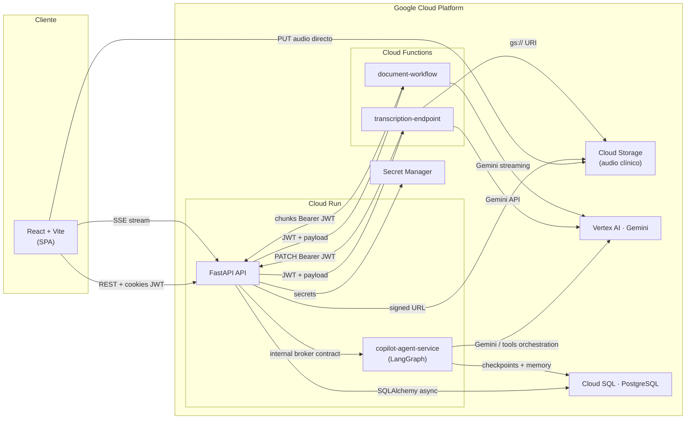
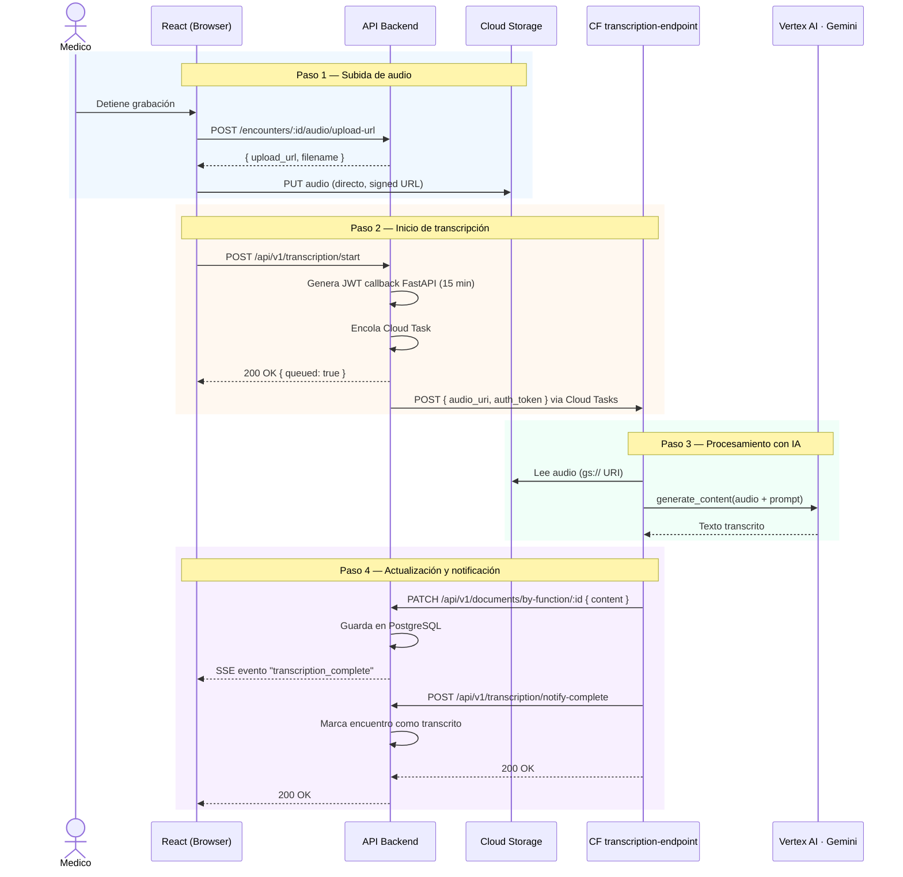
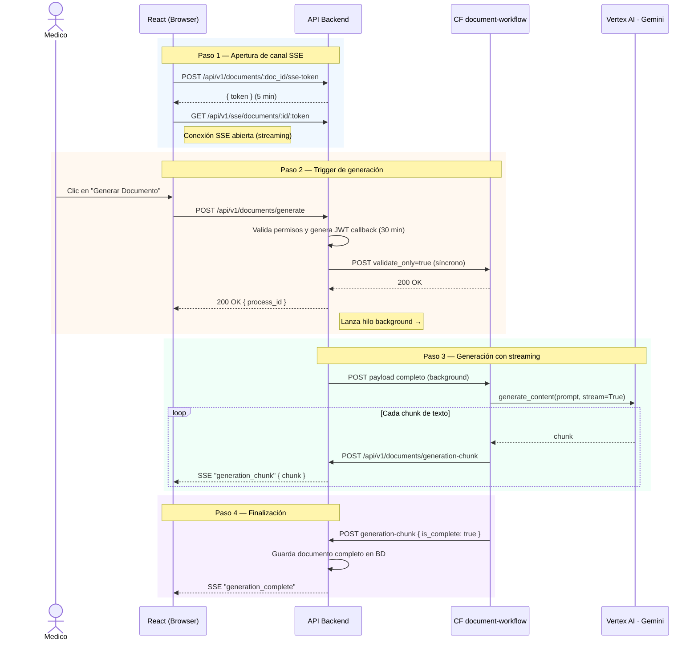

# Visión General del Sistema

Este documento describe la arquitectura global de la plataforma, sus componentes principales y cómo interactúan entre sí.

## 1. Arquitectura de Alto Nivel

El sistema es una plataforma fullstack con un **API FastAPI** en `backend_fastapi/`,
funciones serverless en GCP, un runtime del copiloto y una SPA en React.

---

## 2. Flujo de Transcripción de Audio

El camino completo desde que el médico detiene la grabación hasta que el texto aparece en el editor. En el slice migrado, el kickoff y los callbacks de este flujo viven en FastAPI bajo `/api/v1`.

---

## 3. Flujo de Generación de Documentos

Genera un documento clínico (SOAP, nota de evolución, etc.) combinando la transcripción, el contexto del paciente y una plantilla, con streaming en tiempo real vía SSE. En el slice migrado, el kickoff, SSE token y callbacks de generación viven en FastAPI bajo `/api/v1`.

---

## 4. Componentes y Responsabilidades

| Componente | Stack | Responsabilidad |
|------------|-------|-----------------|
| **Frontend** `webapp/` | React 18, Vite, TypeScript, Tailwind | SPA del médico. Maneja grabación, UI del editor y conexión SSE. |
| **API principal** `backend_fastapi/` | FastAPI, SQLAlchemy async, PostgreSQL | API bajo `/api/v1`, orquestación, JWTs, hub SSE, callbacks y migraciones Alembic. |
| **Copilot Agent** `copilot_agent/` | Python, FastAPI, LangGraph | Runtime del copiloto; broker hacia el API principal. |
| **CF Transcripción** | Python, Functions Framework | Recibe audio de GCS → llama a Gemini → devuelve texto al API. |
| **CF Generación** | Python, Functions Framework | Recibe contexto+plantilla → streaming desde Gemini → envía chunks al API. |
| **Cloud Storage** | GCS | Almacena los audios clínicos. El frontend sube directo vía signed URL. |
| **Vertex AI · Gemini** | Managed (GCP) | Modelo de IA para transcripción y generación de documentos clínicos. |
| **PostgreSQL** | Cloud SQL | Base de datos principal: encuentros, documentos, pacientes, plantillas. |

---

## 5. Puntos de Atención Arquitectónica

- **Hub SSE en memoria**: el hub en `backend_fastapi` usa memoria de proceso. Con múltiples réplicas en Cloud Run, un evento en la instancia A no llega a clientes en la B. Resolver con Redis o Pub/Sub en el futuro.
- **Backend público + DB privada**: Cloud Run sigue público para la SPA, pero PostgreSQL queda aislado por IP privada y acceso vía Cloud SQL Auth Proxy + IAM DB auth.
- **Agent runtime separado**: LangGraph no vive dentro del backend principal. El backend hace de broker y conserva la autoridad clínica/transaccional.
- **Auth interna temporal del copiloto**: el API (FastAPI) y `copilot-agent-service` usan un `shared JWT` temporal en `local`/`stg`; ver deuda canónica en [`../debt/copilot-agent-runtime.md`](../debt/copilot-agent-runtime.md).
- **Audio no se borra al transcribir**: `audio_expires_at` controla el acceso vía API, pero el blob en GCS solo se elimina si el médico lo solicita explícitamente.
- **Cloud Functions IAM-auth**: las funciones están desplegadas con `--no-allow-unauthenticated`; la seguridad depende de IAM de invocación + JWT de callback. El `JWT_SECRET_KEY` no debe filtrarse.

---

## 6. Observabilidad y trazas

OpenTelemetry enlaza las peticiones **navegador (XHR/axios) → API (FastAPI) → Cloud Functions → callbacks al API** cuando el export está configurado (OTLP/Jaeger en local, Cloud Trace en GCP con `GOOGLE_CLOUD_PROJECT`). Los logs del backend incluyen `trace_id` / `span_id` para correlación. Detalle y variables: [`../backend/tracing.md`](../backend/tracing.md). Limitaciones: SSE (`EventSource` sin cabeceras W3C) y subida directa a GCS con signed URL no continúan el mismo trace de extremo a extremo.
