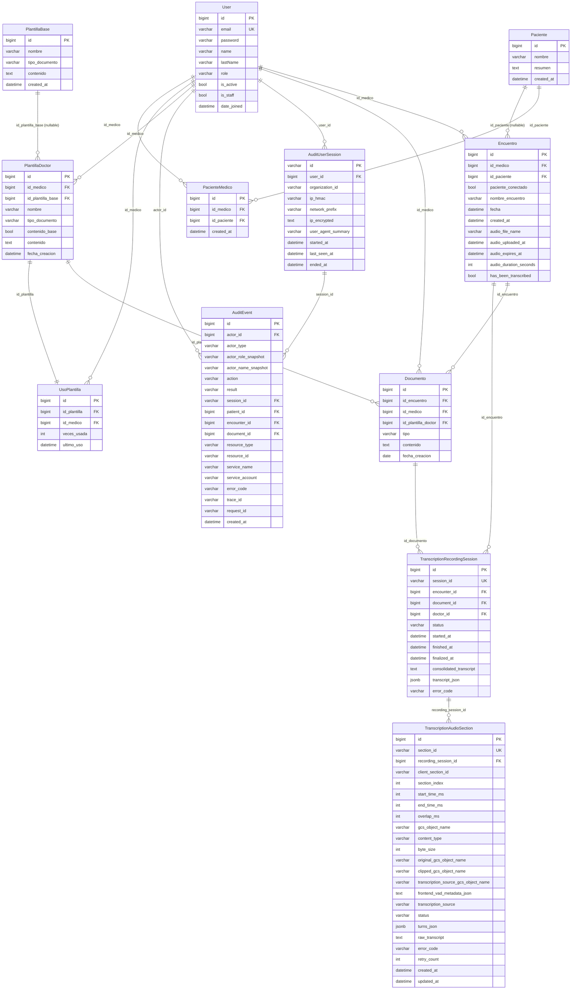

# Documentación de base de datos

> Documento de Fase 1. Refleja el esquema implementado en el código hoy.
> Motor: **PostgreSQL** (Cloud SQL) en develop/production; SQLite como fallback en tests.
> Para una vista global del sistema ver [`../architecture/system-overview.md`](../architecture/system-overview.md).
> Para tokens y seguridad entre servicios ver [`auth-and-jwt.md`](auth-and-jwt.md).

**Esquema en verde (sin datos):** se crea con `alembic upgrade head` en
`backend_fastapi/`; la revisión `0001` aplica
`alembic/baseline/baseline_clinical_v1.sql` (mismo conjunto de tablas clínicas
históricas + `fastapi_revoked_token`, sin admin, sesiones, Silk, ni
`django_migrations`). Nuevas migraciones compartidas van en Alembic. Ver
[`../architecture/backend-fastapi-migration.md`](../architecture/backend-fastapi-migration.md).

## Autenticación IAM (Cloud SQL)

En entornos Cloud (`stg`, `production`), el backend ya **no utiliza contraseñas** (`DB_PASSWORD` fue removido de los secretos por seguridad). En su lugar, utilizamos autenticación IAM integrada nativa de GCP:

1. El backend inicializa su conexión local a `127.0.0.1` en el puerto `5432` provisto por el sidecar **Cloud SQL Auth Proxy**.
2. FastAPI usa el SA del contenedor (`backend-runner@...`) intercambiando temporalmente OAuth tokens por la sesión.
3. El usuario de base de datos en `config/settings/stg.py` asume el nombre truncado de la cuenta de servicio (`DB_USER=backend-runner@<proyecto>.iam`).

> **Importante (PostgreSQL 15+):**
> Al crear el entorno por primera vez con Terraform, el nuevo _IAM User_ no tendrá permisos implícitos en el esquema `public`. El administrador del proyecto debe habilitar temporalmente la IP Pública y conectarse como el usuario maestro `postgres` para conceder permisos explícitos:
>
> ```sql
> GRANT ALL ON DATABASE "<tu-base-de-datos>" TO "backend-runner@<proyecto>.iam";
> GRANT USAGE, CREATE ON SCHEMA public TO "backend-runner@<proyecto>.iam";
> ```
>
> En `stg`, este paso puede ejecutarse mediante el Cloud Run Job
> `vexthealth-cloudsql-iam-grants` una vez exista una versión válida del secret
> `cloudsql-postgres-password`.

---

## ERD — Diagrama entidad-relación



---

## Tablas — descripción detallada

### `users_user` (`backend_fastapi/app/db/models.py`)

Modelo personalizado que extiende `AbstractBaseUser` + `PermissionsMixin`.

| Campo         | Tipo         | Restricciones                                        | Descripción            |
| ------------- | ------------ | ---------------------------------------------------- | ---------------------- |
| `id`          | bigint       | PK, auto                                             | —                      |
| `email`       | varchar(254) | unique, not null                                     | Identificador de login |
| `password`    | varchar(128) | not null                                             | Hash de password       |
| `name`        | varchar(50)  | not null                                             | Nombre del médico      |
| `lastName`    | varchar(50)  | not null                                             | Apellido               |
| `role`        | varchar(20)  | choices canónicos: `doctor`, `admin`; default `doctor` | Rol del usuario        |
| `is_active`   | bool         | default True                                         | Login habilitado; si es `false`, no puede autenticarse |
| `clinical_access_enabled` | bool | default `true` en usuarios existentes; `false` en signup nuevo | Acceso a transcripción y generación documental |
| `is_staff`    | bool         | default False                                        | Acceso admin           |
| `date_joined` | datetime     | default `now()`                                      | —                      |
| `last_login`  | datetime     | nullable                                             | Último login           |

Relaciones M2M:

- `Paciente` a través de `PacienteMedico`
- Grupos y permisos (`auth_group`, `auth_permission`) — tablas heredadas por compatibilidad de schema.

Índices:

- `email` (unique implícito).

Notas operativas:

- La migración `0006_normalize_user_roles` normaliza valores legacy
  `medico -> doctor` y `administrador -> admin`.
- El signup público crea solo usuarios `doctor`.
- Los admins se bootstrapean o promocionan con
  `backend_fastapi/scripts/create_admin.py`; no existe signup público para
  admins.

---

### `pacientes_paciente` (`backend_fastapi/app/db/models.py`)

| Campo        | Tipo         | Restricciones | Descripción                  |
| ------------ | ------------ | ------------- | ---------------------------- |
| `id`         | bigint       | PK, auto      | —                            |
| `nombre`     | varchar(255) | not null      | Nombre completo del paciente |
| `resumen`    | text         | nullable      | Contexto clínico general     |
| `created_at` | datetime     | auto_now_add  | —                            |

---

### `pacientes_pacientemedico` (`backend_fastapi/app/db/models.py`)

Tabla de relación N:M entre `User` (médico) y `Paciente`.

| Campo            | Tipo     | Restricciones                      | Descripción |
| ---------------- | -------- | ---------------------------------- | ----------- |
| `id`             | bigint   | PK, auto                           | —           |
| `id_medico_id`   | bigint   | FK → `users_user`, CASCADE         | Médico      |
| `id_paciente_id` | bigint   | FK → `pacientes_paciente`, CASCADE | Paciente    |
| `created_at`     | datetime | auto_now_add                       | —           |

Restricciones:

- `unique_together = (id_medico, id_paciente)` — un médico no puede tener el mismo paciente dos veces.
- Las rutas de pacientes siempre filtran por esta relación. Borrar un paciente
  desde FastAPI elimina solo los encuentros y datos asociados del médico actual;
  el registro `Paciente` se borra únicamente si no quedan otros médicos
  vinculados.

Índices (definidos en `Meta`):

- `(id_medico)` — `pacientes_p_id_medi_03aa20_idx`
- `(id_paciente)` — `pacientes_p_id_paci_e11792_idx`

---

### `encuentro_encuentro` (`backend_fastapi/app/db/models.py`)

Registro central de una consulta médica. Contiene metadatos del audio grabado.

| Campo                    | Tipo         | Restricciones                                | Descripción                                      |
| ------------------------ | ------------ | -------------------------------------------- | ------------------------------------------------ |
| `id`                     | bigint       | PK, auto                                     | —                                                |
| `id_medico_id`           | bigint       | FK → `users_user`, CASCADE                   | Médico responsable                               |
| `id_paciente_id`         | bigint       | FK → `pacientes_paciente`, CASCADE, nullable | Paciente asociado                                |
| `paciente_conectado`     | bool         | default False                                | Flag de sesión activa                            |
| `nombre_encuentro`       | varchar(255) | nullable                                     | Nombre descriptivo                               |
| `fecha`                  | datetime     | not null                                     | Fecha/hora de la consulta                        |
| `created_at`             | datetime     | auto_now_add                                 | —                                                |
| `audio_file_name`        | varchar(255) | nullable                                     | Ruta en GCS: `encounter_audio/{id}/{uuid}.webm`  |
| `audio_uploaded_at`      | datetime     | nullable                                     | Timestamp de subida a GCS                        |
| `audio_expires_at`       | datetime     | nullable                                     | `audio_uploaded_at + 24 h` (seteado en `save()`) |
| `audio_duration_seconds` | int          | nullable                                     | Duración en segundos                             |
| `has_been_transcribed`   | bool         | default False                                | Si el audio fue transcrito                       |

Lógica en `save()`:

- Al asignar `audio_file_name` por primera vez, establece `audio_uploaded_at` y `audio_expires_at` automáticamente.

Método de modelo:

- `is_audio_expired()` → `bool`: compara `audio_expires_at` con `now()`.

Índices:

- `(id_medico)` — `encuentro_e_id_medi_866981_idx`
- `(id_paciente)` — `encuentro_e_id_paci_d75317_idx`

Orden por defecto: `-created_at`.

---

### `documentos_documento` (`backend_fastapi/app/db/models.py`)

Contenedor de texto clínico asociado a un encuentro. Un encuentro puede tener
múltiples documentos de distinto tipo.

| Campo                    | Tipo        | Restricciones                                             | Descripción                |
| ------------------------ | ----------- | --------------------------------------------------------- | -------------------------- |
| `id`                     | bigint      | PK, auto                                                  | —                          |
| `id_encuentro_id`        | bigint      | FK → `encuentro_encuentro`, CASCADE                       | Encuentro padre            |
| `id_medico_id`           | bigint      | FK → `users_user`, CASCADE                                | Médico propietario         |
| `id_plantilla_doctor_id` | bigint      | FK → `plantillas_plantilladoctor`, SET_NULL, nullable     | Plantilla usada            |
| `tipo`                   | varchar(20) | choices: `contexto`, `transcripcion`, `plantilla`, `nota` | Tipo de documento          |
| `content_markdown`       | text        | not null (default `""`)                                   | Markdown derivado / compat |
| `content_json`           | jsonb       | nullable                                                  | Canónico del editor Tiptap |
| `fecha_creacion`         | date        | auto_now_add                                              | —                          |

Al crear un nuevo `Encuentro`, FastAPI crea automáticamente dos documentos vacíos:
uno de tipo `contexto` y otro de tipo `transcripcion`.

### Nota de compatibilidad 2026-04

- El backend ya no trata el documento clínico como un único string canónico.
- `content_json` es la fuente de verdad del editor rico.
- `content_markdown` se mantiene para:
  - compatibilidad con endpoints/frontend legacy
  - pre-seed del copilot
  - apply/patching clínico, que todavía opera sobre markdown/texto
- El backend ahora sincroniza ambos campos en todos los write paths soportados:
  - si entra `content_json`, regenera `content_markdown`
  - si entra solo markdown/texto, regenera `content_json`
- La sincronización vive en `backend_fastapi/app/domains/documents/content.py`; no se debe duplicar esta lógica en endpoints o servicios aislados.
- `content` sigue existiendo como alias legacy de compat a `content_markdown`, pero ya no debe usarse como un segundo campo persistente.
- La estructura de secciones todavía no se persiste en una tabla propia. El backend la extrae de forma determinista al leer el documento para el copilot usando headings reales del markdown.

### Flujo operativo `content_json` ↔ `content_markdown`

La regla general es simple:

- si el write path es de editor/UI y trae `content_json`, el backend trata JSON como input preferido y regenera `content_markdown`
- si el write path es de callback, patch apply o integración markdown-first, el backend trata markdown/texto como input preferido y regenera `content_json`
- los read paths normales devuelven ambos campos ya sincronizados
- el runtime del copilot hoy consume markdown como contrato operativo seguro, aunque el backend siga persistiendo ambos campos

La sincronización central vive en `backend_fastapi/app/domains/documents/content.py`:

- `build_synced_document_content(...)`
- `set_document_content_fields(...)`
- `markdown_to_tiptap_json(...)`
- `tiptap_json_to_markdown(...)`

#### Cuándo ocurre cada dirección de conversión

| Flujo                                                                                     | Entrada preferida                                             | Conversión que hace FastAPI                                                                                      | Resultado persistido / expuesto                                                                                   |
| ----------------------------------------------------------------------------------------- | ------------------------------------------------------------- | ---------------------------------------------------------------------------------------------------------------- | ----------------------------------------------------------------------------------------------------------------- |
| Editor crea o actualiza documento (`POST /documents`, `PATCH /documents/by-editor/{id}`)  | `content_json` si viene presente; si no, markdown             | `content_json -> content_markdown` cuando hay JSON. Si no hay JSON, `content_markdown -> content_json`           | Se guardan `content_markdown + content_json`; las respuestas del API devuelven ambos                              |
| Callback o función actualiza documento (`PATCH /documents/by-function/{id}`)              | markdown si viene `content_markdown` o `content`; si no, JSON | Normalmente `content_markdown -> content_json`; si el caller manda solo JSON, `content_json -> content_markdown` | Se guardan ambos campos sincronizados                                                                             |
| Streaming/generation chunk final (`POST /documents/generation-chunk`, `is_complete=true`) | markdown chunk final                                          | `content_markdown -> content_json`                                                                               | Se guardan ambos campos sincronizados antes de notificar SSE                                                      |
| Patch apply clínico aceptado (`backend_fastapi/app/domains/copilot/patch_sets.py`)        | markdown canónico actual del documento                        | Aplica patches sobre markdown y luego `content_markdown -> content_json`                                         | El documento queda persistido con ambos campos actualizados; además otros patch sets viejos pueden quedar `stale` |
| Lectura normal de documento desde backend                                                 | ninguno; solo serializa estado actual                         | no convierte si ya está persistido sincronizado                                                                  | Se exponen `content`, `content_markdown` y `content_json`                                                         |
| Bootstrap del runtime copilot (`workspace_index`)                                         | `content_markdown` opcional enviado por frontend              | no hay conversión dentro del runtime; solo pre-seed de lectura full                                              | El runtime usa markdown. `content_json` puede viajar por compat/UX futura, pero hoy no se usa para patching       |

#### Consecuencias operativas

- El frontend no necesita adivinar qué representación es canónica por endpoint; debe mandar la representación natural del flujo y dejar que FastAPI sincronice la otra.
- El editor rico debe seguir prefiriendo `content_json` como payload semántico principal.
- Los write paths automáticos, callbacks y patch apply siguen siendo markdown-first porque el contrato clínico de patching y anchors todavía opera sobre texto/markdown.
- El copilot runtime puede recibir `content_json` en `workspace_index`, pero hoy solo confía en `content_markdown` para lecturas pre-seedeadas, `base_hash` y drafting.
- Si en el futuro el runtime pasa a operar sobre JSON rico, este cuadro deberá actualizarse junto con `docs/agent/RUNTIME.md`.

Sin índices adicionales definidos en `Meta` (aparte del PK y las FKs implícitas).

---

### `plantillas_plantillabase` (`backend_fastapi/app/db/models.py`)

Plantillas del sistema, disponibles para todos los médicos como punto de partida.

| Campo            | Tipo         | Restricciones                                          | Descripción                              |
| ---------------- | ------------ | ------------------------------------------------------ | ---------------------------------------- |
| `id`             | bigint       | PK, auto                                               | —                                        |
| `nombre`         | varchar(255) | not null                                               | Nombre de la plantilla                   |
| `tipo_documento` | varchar(50)  | choices: `nota`, `documento`, `otros`; default `otros` | Categoría                                |
| `contenido`      | text         | not null                                               | Estructura/instrucciones de la plantilla |
| `created_at`     | datetime     | auto_now_add                                           | —                                        |

Índices:

- `(tipo_documento)` — `plantillas__tipo_do_313b9d_idx`

---

### `plantillas_plantilladoctor` (`backend_fastapi/app/db/models.py`)

Plantillas personalizadas por médico. Puede heredar el contenido de `PlantillaBase`
(`contenido_base=True`) o tener su propio texto (`contenido_base=False`).

| Campo                  | Tipo         | Restricciones                                          | Descripción                                      |
| ---------------------- | ------------ | ------------------------------------------------------ | ------------------------------------------------ |
| `id`                   | bigint       | PK, auto                                               | —                                                |
| `id_medico_id`         | bigint       | FK → `users_user`, CASCADE                             | Dueño de la plantilla                            |
| `id_plantilla_base_id` | bigint       | FK → `plantillas_plantillabase`, SET_NULL, nullable    | Origen                                           |
| `nombre`               | varchar(255) | not null                                               | —                                                |
| `tipo_documento`       | varchar(50)  | choices: `nota`, `documento`, `otros`; default `otros` | —                                                |
| `contenido_base`       | bool         | default False                                          | Si usa el contenido de la `PlantillaBase`        |
| `contenido`            | text         | nullable                                               | Contenido propio (cuando `contenido_base=False`) |
| `fecha_creacion`       | datetime     | auto_now_add                                           | —                                                |

Método de modelo:

- `get_contenido_efectivo()` → devuelve `PlantillaBase.contenido` si `contenido_base=True`, si no devuelve `contenido`.

Índices:

- `(id_medico)` — `plantillas__id_medi_57f753_idx`
- `(tipo_documento)` — `plantillas__tipo_do_ed5d1b_idx`
- `(id_plantilla_base)` — `plantillas__id_plan_4690bf_idx`

---

### `plantillas_usoplantilla` (`backend_fastapi/app/db/models.py`)

Estadísticas de uso por plantilla y médico.

| Campo             | Tipo            | Restricciones                              | Descripción      |
| ----------------- | --------------- | ------------------------------------------ | ---------------- |
| `id`              | bigint          | PK, auto                                   | —                |
| `id_plantilla_id` | bigint          | FK → `plantillas_plantilladoctor`, CASCADE | Plantilla        |
| `id_medico_id`    | bigint          | FK → `users_user`, CASCADE                 | Médico           |
| `veces_usada`     | PositiveInteger | default 0                                  | Contador de usos |
| `ultimo_uso`      | datetime        | nullable                                   | Último acceso    |

Restricciones:

- `unique_together = (id_plantilla, id_medico)` — una fila por combinación.

Índices:

- `(id_plantilla)` — `plantillas_u_id_plan_…_idx`
- `(id_medico)` — `plantillas_u_id_medi_…_idx`

---

### `copilot_copilotrun`, `copilot_copilotpatchset`, `copilot_copilotpatch` (`backend_fastapi/app/db/models.py`)

Persisten el broker del runtime del copiloto, el review humano y el apply seguro de escritura clínica.

#### `copilot_copilotrun`

| Campo                      | Tipo         | Restricciones                                                 | Descripción                                                |
| -------------------------- | ------------ | ------------------------------------------------------------- | ---------------------------------------------------------- |
| `run_id`                   | varchar(64)  | unique, not null                                              | Identificador del run brokered con `copilot-agent-service` |
| `thread_id`                | varchar(255) | not null                                                      | Thread estable por `encounter + doctor`                    |
| `doctor_id`                | bigint       | FK → `users_user`, CASCADE                                    | Médico dueño del run                                       |
| `encounter_id`             | bigint       | FK → `encuentro_encuentro`, CASCADE                           | Encuentro dueño del run                                    |
| `status`                   | varchar(32)  | `created`, `running`, `waiting_review`, `completed`, `failed` | Estado público del run                                     |
| `intent`                   | varchar(64)  | nullable                                                      | Intención canónica inferida por el runtime                 |
| `requires_human_review`    | bool         | default false                                                 | Flag de pausa para writer flow                             |
| `created_at`, `updated_at` | datetime     | auto                                                          | Trazabilidad básica                                        |

Índices:

- `(doctor, encounter)` — `copilot_cop_doctor__553b6b_idx`
- `(thread_id)` — `copilot_cop_thread__60ab29_idx`

#### `copilot_copilotpatchset`

Unidad de review del writer flow. En v1 apunta a **un solo documento target por run** y agrupa hasta ~12 cambios pequeños propuestos por el agente.

| Campo                         | Tipo         | Restricciones                                                               | Descripción                                                      |
| ----------------------------- | ------------ | --------------------------------------------------------------------------- | ---------------------------------------------------------------- |
| `patch_set_id`                | varchar(64)  | unique, not null                                                            | ID externo del conjunto de sugerencias                           |
| `run_id`                      | bigint       | FK → `copilot_copilotrun`, CASCADE                                          | Run que originó el set                                           |
| `doctor_id`                   | bigint       | FK → `users_user`, CASCADE                                                  | Dueño                                                            |
| `encounter_id`                | bigint       | FK → `encuentro_encuentro`, CASCADE                                         | Encounter asociado                                               |
| `target_document_id`          | bigint       | FK → `documentos_documento`, CASCADE                                        | Documento canónico que puede mutarse                             |
| `base_version`                | int          | not null                                                                    | Versión lógica del documento usada al proponer                   |
| `base_hash`                   | varchar(128) | not null                                                                    | Hash del contenido base para stale detection                     |
| `rationale`                   | text         | nullable                                                                    | Justificación general del set                                    |
| `source_context_document_ids` | json         | default `[]`                                                                | IDs de documentos usados como contexto                           |
| `target_document_title`       | varchar(255) | nullable                                                                    | Título usado para review/debug                                   |
| `target_selection_reason`     | text         | nullable                                                                    | Motivo determinístico de selección del target                    |
| `document_preview_after`      | text         | nullable                                                                    | Preview combinado del documento tras aplicar los cambios válidos |
| `status`                      | varchar(32)  | `pending`, `partially_accepted`, `accepted`, `rejected`, `stale`, `applied` | Estado agregado del set                                          |
| `review_comment`              | text         | nullable                                                                    | Comentario humano final del review/apply                         |

Índices:

- `(run, status)` — `copilot_pset_run_status_idx`
- `(doctor, encounter)` — `copilot_pset_doctor_enc_idx`
- `(target_document)` — `copilot_pset_target_doc_idx`

#### `copilot_copilotpatch`

Unidad granular de cambio. Cada fila representa un cambio anclado que FastAPI puede aceptar, rechazar, marcar como conflictivo o aplicar.

| Campo                             | Tipo         | Restricciones                                                       | Descripción                                                                         |
| --------------------------------- | ------------ | ------------------------------------------------------------------- | ----------------------------------------------------------------------------------- |
| `patch_id`                        | varchar(64)  | unique, not null                                                    | ID externo del cambio                                                               |
| `patch_set_id`                    | bigint       | FK → `copilot_copilotpatchset`, nullable                            | Set padre; los rows legacy pueden nacer sin set y se normalizan al vuelo            |
| `run_id`                          | bigint       | FK → `copilot_copilotrun`, CASCADE                                  | Run que originó el cambio                                                           |
| `target_document_id`              | bigint       | FK → `documentos_documento`, CASCADE                                | Documento objetivo                                                                  |
| `base_version`                    | int          | not null                                                            | Versión lógica usada al proponer                                                    |
| `order_index`                     | int          | default 0                                                           | Orden estable de aplicación dentro del set                                          |
| `patch_type`                      | varchar(64)  | not null                                                            | `replace_span`, `insert_before`, `insert_after`, `delete_span` o legado normalizado |
| `operation_type`                  | varchar(64)  | not null                                                            | Valor bruto del runtime para compatibilidad                                         |
| `anchor`                          | json         | default `{}`                                                        | Anchor textual del cambio                                                           |
| `expected_hash`                   | varchar(128) | nullable                                                            | Hash esperado del span/ancla                                                        |
| `old_text`, `new_text`            | text         | nullable                                                            | Texto previo y propuesto                                                            |
| `resolved_start`, `resolved_end`  | int          | nullable                                                            | Rango resuelto por FastAPI sobre el contenido base                                  |
| `confidence`                      | float        | nullable                                                            | Confianza del runtime cuando exista                                                 |
| `conflict_reason`                 | text         | nullable                                                            | Motivo de conflicto interno o stale                                                 |
| `before_preview`, `after_preview` | text         | nullable                                                            | Preview corto del cambio                                                            |
| `document_preview_after`          | text         | nullable                                                            | Preview del documento luego de aplicar ese cambio                                   |
| `content_preview`                 | text         | not null                                                            | Fallback legacy para previews                                                       |
| `status`                          | varchar(32)  | `pending`, `accepted`, `rejected`, `conflicted`, `applied`, `stale` | Estado por cambio                                                                   |

Índices:

- `(patch_set, status)` — `copilot_patch_pset_status_idx`
- `(run, status)` — `copilot_cop_run_id_468f25_idx`
- `(doctor, encounter)` — `copilot_cop_doctor__6f0cd0_idx`
- `(target_document)` — `copilot_cop_target__1321e5_idx`

Notas de operación:

- FastAPI, no el frontend, resuelve anchors a `resolved_start/resolved_end`.
- Si el `base_hash` ya no coincide al aplicar, el `CopilotPatchSet` pasa a `stale`.
- El endpoint legacy `/api/copilot/runs/{run_id}/review` sigue existiendo solo para patch sets de un cambio mientras migra la UI.

---

## Transcripción estructurada (`chunks[].turns[]`)

- **Canónico por sección:** `transcription_audio_section.turns_json` (JSONB).
- **Canónico consolidado:** `transcription_recording_session.transcript_json` con forma `{ session_id, chunks: [{ chunk_id, start_ms, end_ms, turns[] }] }`.
- **Legacy:** `raw_transcript` y `consolidated_transcript` siguen existiendo para sesiones históricas; no hay backfill automático a speakers/overlaps.
- **Proyección:** `documents_document.content_markdown` se deriva al consolidar para editor y generación documental legacy; la generación nueva lee primero `transcript_json`.
- **Speakers permitidos:** `MEDICO`, `PACIENTE`, `ACOMPANANTE`, `DESCONOCIDO`.
- **Dedup:** solo entre chunks vecinos al consolidar; `overlaps_*` del modelo describe solapamiento conversacional, no el overlap técnico de audio.

---

## Convenciones de naming

| Convención                                  | Ejemplo                                            |
| ------------------------------------------- | -------------------------------------------------- |
| Tablas: nombres históricos `{app}_{model}`  | `encuentro_encuentro`, `pacientes_paciente`        |
| FKs con `_id` como sufijo                   | `id_medico_id`, `id_paciente_id`                   |
| Timestamps: `created_at` / `fecha_creacion` | `Encuentro.created_at`, `Documento.fecha_creacion` |
| Booleanos de estado: verbo pasado           | `has_been_transcribed`, `paciente_conectado`       |

---

## Pool de conexiones

`CONN_MAX_AGE` está configurado en `stg` con valor por defecto `300` segundos
(sobrescribible por variable de entorno). En `develop.py` y `production.py` no se fija,
por lo que los entornos actuales dependen de la configuración explícita de FastAPI.

En Cloud Run, ajustar `CONN_MAX_AGE` debe hacerse junto con el límite de conexiones de
Cloud SQL y la arquitectura descrita en `docs/architecture/system-overview.md`.

---

## Migraciones

| App          | Migraciones                                                     | Estado |
| ------------ | --------------------------------------------------------------- | ------ |
| `users`      | `0001_initial`                                                  | ✓      |
| `pacientes`  | `0001_initial`, `0002_initial`                                  | ✓      |
| `encuentro`  | `0001–0005` (audio fields, has_been_transcribed)                | ✓      |
| `documentos` | `0001_initial`, `0002_alter_tipo`                               | ✓      |
| `plantillas` | `0001_initial`, `0002_usoplantilla`, `0003_seed_base_templates`; FastAPI `0004_seed_clinical_base_templates` | ✓      |
| `copilot`    | `0001_initial`–`0006_copilotpatchset_and_granular_patches`      | ✓      |

La migración histórica `plantillas/0003_seed_base_templates.py` y la migración FastAPI
`0004_seed_clinical_base_templates.py` inyectan datos iniciales de `PlantillaBase`
(en el despliegue, los nuevos usuarios reciben automáticamente una `PlantillaDoctor` por cada fila existente en `PlantillaBase`).
