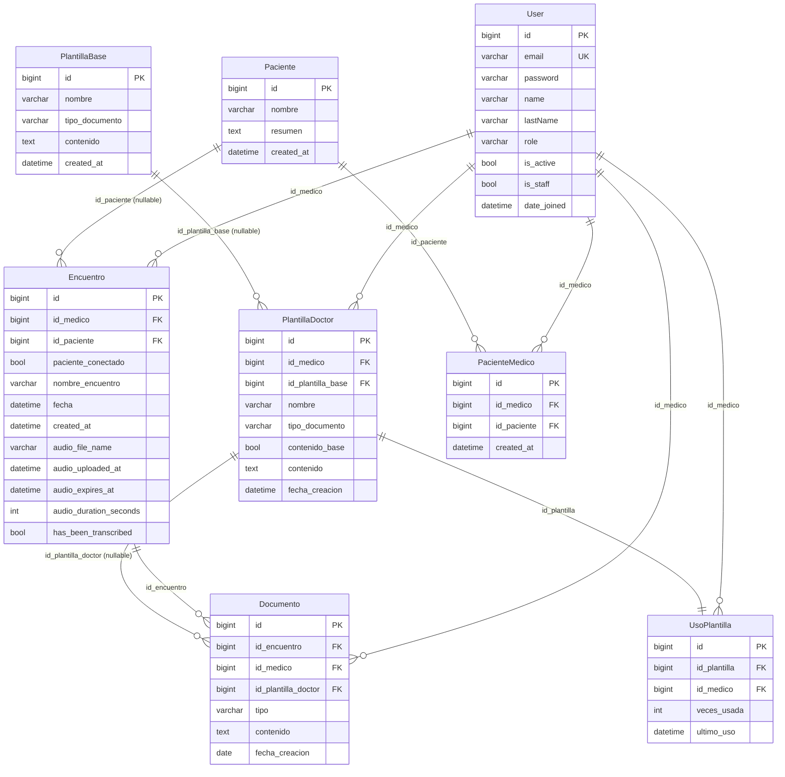

# Documentación de base de datos

> Documento de Fase 1. Refleja el esquema implementado en el código hoy.
> Motor: **PostgreSQL** (Cloud SQL) en develop/production; SQLite como fallback en tests.
> Para una vista global del sistema ver [`../architecture/system-overview.md`](../architecture/system-overview.md).
> Para tokens y seguridad entre servicios ver [`auth-and-jwt.md`](auth-and-jwt.md).

## Autenticación IAM (Cloud SQL)

En entornos Cloud (`stg`, `production`), el backend ya **no utiliza contraseñas** (`DB_PASSWORD` fue removido de los secretos por seguridad). En su lugar, utilizamos autenticación IAM integrada nativa de GCP:

1. El backend inicializa su conexión local a `127.0.0.1` en el puerto `5432` provisto por el sidecar **Cloud SQL Auth Proxy**.
2. Django usa el SA del contenedor (`backend-runner@...`) intercambiando temporalmente OAuth tokens por la sesión.
3. El usuario de base de datos en `config/settings/stg.py` asume el nombre truncado de la cuenta de servicio (`DB_USER=backend-runner@<proyecto>.iam`).

> **Importante (PostgreSQL 15+):**
> Al crear el entorno por primera vez con Terraform, el nuevo _IAM User_ no tendrá permisos implícitos en el esquema `public`. El administrador del proyecto debe habilitar temporalmente la IP Pública y conectarse como el usuario maestro `postgres` para conceder permisos explícitos:
>
> ```sql
> GRANT ALL ON SCHEMA public TO "backend-runner@<proyecto>.iam";
> GRANT ALL ON DATABASE "<tu-base-de-datos>" TO "backend-runner@<proyecto>.iam";
> ```
>
> _(Este paso ya fue realizado en el entorno `stg`)_.

---

## ERD — Diagrama entidad-relación



---

## Tablas — descripción detallada

### `users_user` (`apps/users/models.py`)

Modelo personalizado que extiende `AbstractBaseUser` + `PermissionsMixin`.

| Campo         | Tipo         | Restricciones                                        | Descripción            |
| ------------- | ------------ | ---------------------------------------------------- | ---------------------- |
| `id`          | bigint       | PK, auto                                             | —                      |
| `email`       | varchar(254) | unique, not null                                     | Identificador de login |
| `password`    | varchar(128) | not null                                             | Hash Django            |
| `name`        | varchar(50)  | not null                                             | Nombre del médico      |
| `lastName`    | varchar(50)  | not null                                             | Apellido               |
| `role`        | varchar(20)  | choices: `medico`, `administrador`; default `medico` | Rol del usuario        |
| `is_active`   | bool         | default True                                         | Soft-delete            |
| `is_staff`    | bool         | default False                                        | Acceso admin           |
| `date_joined` | datetime     | default `now()`                                      | —                      |
| `last_login`  | datetime     | nullable                                             | Gestionado por Django  |

Relaciones M2M:

- `Paciente` a través de `PacienteMedico`
- Grupos y permisos Django (`auth_group`, `auth_permission`) — heredados.

Índices:

- `email` (unique implícito).

---

### `pacientes_paciente` (`apps/pacientes/models.py`)

| Campo        | Tipo         | Restricciones | Descripción                  |
| ------------ | ------------ | ------------- | ---------------------------- |
| `id`         | bigint       | PK, auto      | —                            |
| `nombre`     | varchar(255) | not null      | Nombre completo del paciente |
| `resumen`    | text         | nullable      | Contexto clínico general     |
| `created_at` | datetime     | auto_now_add  | —                            |

---

### `pacientes_pacientemedico` (`apps/pacientes/models.py`)

Tabla de relación N:M entre `User` (médico) y `Paciente`.

| Campo            | Tipo     | Restricciones                      | Descripción |
| ---------------- | -------- | ---------------------------------- | ----------- |
| `id`             | bigint   | PK, auto                           | —           |
| `id_medico_id`   | bigint   | FK → `users_user`, CASCADE         | Médico      |
| `id_paciente_id` | bigint   | FK → `pacientes_paciente`, CASCADE | Paciente    |
| `created_at`     | datetime | auto_now_add                       | —           |

Restricciones:

- `unique_together = (id_medico, id_paciente)` — un médico no puede tener el mismo paciente dos veces.

Índices (definidos en `Meta`):

- `(id_medico)` — `pacientes_p_id_medi_03aa20_idx`
- `(id_paciente)` — `pacientes_p_id_paci_e11792_idx`

---

### `encuentro_encuentro` (`apps/encuentro/models.py`)

Registro central de una consulta médica. Contiene metadatos del audio grabado.

| Campo                    | Tipo         | Restricciones                                | Descripción                                      |
| ------------------------ | ------------ | -------------------------------------------- | ------------------------------------------------ |
| `id`                     | bigint       | PK, auto                                     | —                                                |
| `id_medico_id`           | bigint       | FK → `users_user`, CASCADE                   | Médico responsable                               |
| `id_paciente_id`         | bigint       | FK → `pacientes_paciente`, CASCADE, nullable | Paciente asociado                                |
| `paciente_conectado`     | bool         | default False                                | Flag de sesión activa                            |
| `nombre_encuentro`       | varchar(255) | nullable                                     | Nombre descriptivo                               |
| `fecha`                  | datetime     | not null                                     | Fecha/hora de la consulta                        |
| `created_at`             | datetime     | auto_now_add                                 | —                                                |
| `audio_file_name`        | varchar(255) | nullable                                     | Ruta en GCS: `encounter_audio/{id}/{uuid}.webm`  |
| `audio_uploaded_at`      | datetime     | nullable                                     | Timestamp de subida a GCS                        |
| `audio_expires_at`       | datetime     | nullable                                     | `audio_uploaded_at + 24 h` (seteado en `save()`) |
| `audio_duration_seconds` | int          | nullable                                     | Duración en segundos                             |
| `has_been_transcribed`   | bool         | default False                                | Si el audio fue transcrito                       |

Lógica en `save()`:

- Al asignar `audio_file_name` por primera vez, establece `audio_uploaded_at` y `audio_expires_at` automáticamente.

Método de modelo:

- `is_audio_expired()` → `bool`: compara `audio_expires_at` con `now()`.

Índices:

- `(id_medico)` — `encuentro_e_id_medi_866981_idx`
- `(id_paciente)` — `encuentro_e_id_paci_d75317_idx`

Orden por defecto: `-created_at`.

---

### `documentos_documento` (`apps/documentos/models.py`)

Contenedor de texto clínico asociado a un encuentro. Un encuentro puede tener
múltiples documentos de distinto tipo.

| Campo                    | Tipo        | Restricciones                                             | Descripción         |
| ------------------------ | ----------- | --------------------------------------------------------- | ------------------- |
| `id`                     | bigint      | PK, auto                                                  | —                   |
| `id_encuentro_id`        | bigint      | FK → `encuentro_encuentro`, CASCADE                       | Encuentro padre     |
| `id_medico_id`           | bigint      | FK → `users_user`, CASCADE                                | Médico propietario  |
| `id_plantilla_doctor_id` | bigint      | FK → `plantillas_plantilladoctor`, SET_NULL, nullable     | Plantilla usada     |
| `tipo`                   | varchar(20) | choices: `contexto`, `transcripcion`, `plantilla`, `nota` | Tipo de documento   |
| `contenido`              | text        | not null (default `""`)                                   | Texto del documento |
| `fecha_creacion`         | date        | auto_now_add                                              | —                   |

Al crear un nuevo `Encuentro`, Django crea automáticamente dos documentos vacíos:
uno de tipo `contexto` y otro de tipo `transcripcion` (`encuentro/api.py` → `create_empty_encuentro`).

Sin índices adicionales definidos en `Meta` (aparte del PK y las FKs implícitas).

---

### `plantillas_plantillabase` (`apps/plantillas/models.py`)

Plantillas del sistema, disponibles para todos los médicos como punto de partida.

| Campo            | Tipo         | Restricciones                                          | Descripción                              |
| ---------------- | ------------ | ------------------------------------------------------ | ---------------------------------------- |
| `id`             | bigint       | PK, auto                                               | —                                        |
| `nombre`         | varchar(255) | not null                                               | Nombre de la plantilla                   |
| `tipo_documento` | varchar(50)  | choices: `nota`, `documento`, `otros`; default `otros` | Categoría                                |
| `contenido`      | text         | not null                                               | Estructura/instrucciones de la plantilla |
| `created_at`     | datetime     | auto_now_add                                           | —                                        |

Índices:

- `(tipo_documento)` — `plantillas__tipo_do_313b9d_idx`

---

### `plantillas_plantilladoctor` (`apps/plantillas/models.py`)

Plantillas personalizadas por médico. Puede heredar el contenido de `PlantillaBase`
(`contenido_base=True`) o tener su propio texto (`contenido_base=False`).

| Campo                  | Tipo         | Restricciones                                          | Descripción                                      |
| ---------------------- | ------------ | ------------------------------------------------------ | ------------------------------------------------ |
| `id`                   | bigint       | PK, auto                                               | —                                                |
| `id_medico_id`         | bigint       | FK → `users_user`, CASCADE                             | Dueño de la plantilla                            |
| `id_plantilla_base_id` | bigint       | FK → `plantillas_plantillabase`, SET_NULL, nullable    | Origen                                           |
| `nombre`               | varchar(255) | not null                                               | —                                                |
| `tipo_documento`       | varchar(50)  | choices: `nota`, `documento`, `otros`; default `otros` | —                                                |
| `contenido_base`       | bool         | default False                                          | Si usa el contenido de la `PlantillaBase`        |
| `contenido`            | text         | nullable                                               | Contenido propio (cuando `contenido_base=False`) |
| `fecha_creacion`       | datetime     | auto_now_add                                           | —                                                |

Método de modelo:

- `get_contenido_efectivo()` → devuelve `PlantillaBase.contenido` si `contenido_base=True`, si no devuelve `contenido`.

Índices:

- `(id_medico)` — `plantillas__id_medi_57f753_idx`
- `(tipo_documento)` — `plantillas__tipo_do_ed5d1b_idx`
- `(id_plantilla_base)` — `plantillas__id_plan_4690bf_idx`

---

### `plantillas_usoplantilla` (`apps/plantillas/models.py`)

Estadísticas de uso por plantilla y médico.

| Campo             | Tipo            | Restricciones                              | Descripción      |
| ----------------- | --------------- | ------------------------------------------ | ---------------- |
| `id`              | bigint          | PK, auto                                   | —                |
| `id_plantilla_id` | bigint          | FK → `plantillas_plantilladoctor`, CASCADE | Plantilla        |
| `id_medico_id`    | bigint          | FK → `users_user`, CASCADE                 | Médico           |
| `veces_usada`     | PositiveInteger | default 0                                  | Contador de usos |
| `ultimo_uso`      | datetime        | nullable                                   | Último acceso    |

Restricciones:

- `unique_together = (id_plantilla, id_medico)` — una fila por combinación.

Índices:

- `(id_plantilla)` — `plantillas_u_id_plan_…_idx`
- `(id_medico)` — `plantillas_u_id_medi_…_idx`

---

## Convenciones de naming

| Convención                                  | Ejemplo                                            |
| ------------------------------------------- | -------------------------------------------------- |
| Tablas: `{app}_{model}` (Django default)    | `encuentro_encuentro`, `pacientes_paciente`        |
| FKs con `_id` como sufijo                   | `id_medico_id`, `id_paciente_id`                   |
| Timestamps: `created_at` / `fecha_creacion` | `Encuentro.created_at`, `Documento.fecha_creacion` |
| Booleanos de estado: verbo pasado           | `has_been_transcribed`, `paciente_conectado`       |

---

## Pool de conexiones

`CONN_MAX_AGE` está configurado en `stg` con valor por defecto `300` segundos
(sobrescribible por variable de entorno). En `develop.py` y `production.py` no se fija,
por lo que Django usa su comportamiento por defecto para esos entornos.

En Cloud Run, ajustar `CONN_MAX_AGE` debe hacerse junto con el límite de conexiones de
Cloud SQL y la arquitectura descrita en `docs/architecture/system-overview.md`.

---

## Migraciones

| App          | Migraciones                                                     | Estado |
| ------------ | --------------------------------------------------------------- | ------ |
| `users`      | `0001_initial`                                                  | ✓      |
| `pacientes`  | `0001_initial`, `0002_initial`                                  | ✓      |
| `encuentro`  | `0001–0005` (audio fields, has_been_transcribed)                | ✓      |
| `documentos` | `0001_initial`, `0002_alter_tipo`                               | ✓      |
| `plantillas` | `0001_initial`, `0002_usoplantilla`, `0003_seed_base_templates` | ✓      |

La migración `plantillas/0003_seed_base_templates.py` inyecta datos iniciales de `PlantillaBase`
(en el despliegue, los nuevos usuarios reciben automáticamente una `PlantillaDoctor` por cada fila existente en `PlantillaBase`).
